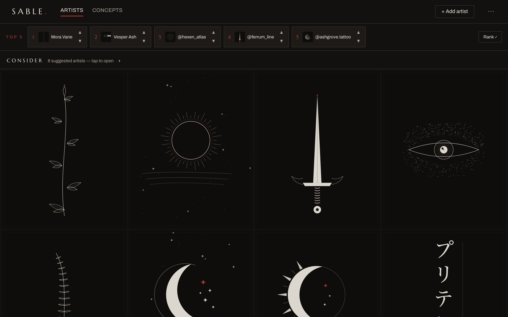
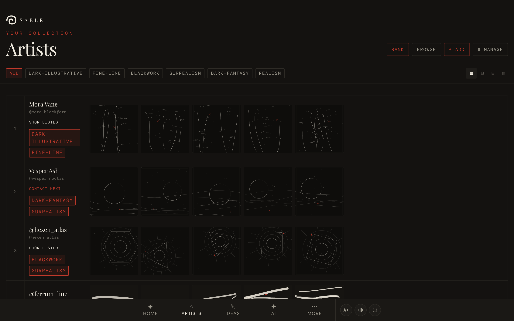
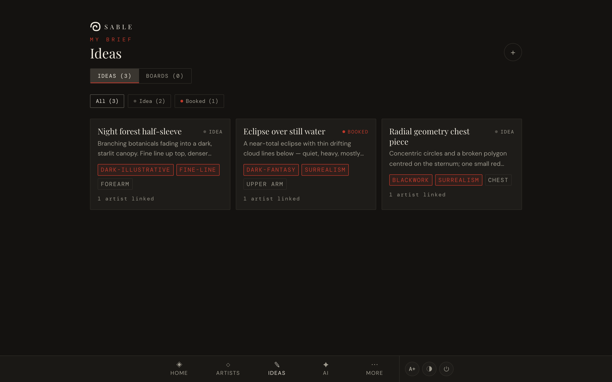
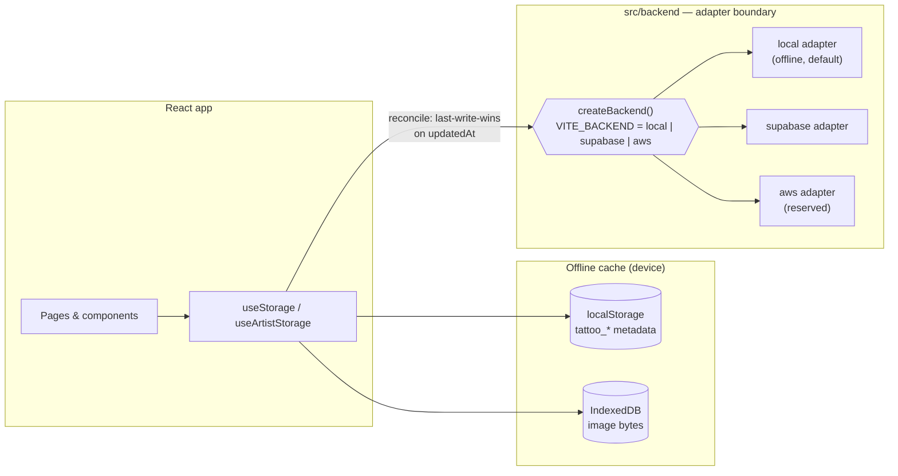

# Sable

[](https://github.com/Pritesh1980/sable/actions/workflows/ci.yml)
[](https://github.com/Pritesh1980/sable/actions/workflows/deploy-pages.yml)
[](https://github.com/Pritesh1980/sable/releases/latest)
[](https://pritesh1980.github.io/sable/?demo=1)

Sable is a local-first Progressive Web App for planning a personal tattoo journey. It keeps a curated artist collection, ranks favourites, links artists to tattoo ideas, groups ideas into mood boards, generates AI concept prompts/results, exports relief STL files from concept images, and tracks useful studio and convention context.



The app is built for Pritesh's own workflow. A live, backend-free demo runs on GitHub Pages; a real accounts + sync deployment (S3 + CloudFront) is left for later.

## Try the demo

**▶ [Live demo](https://pritesh1980.github.io/sable/?demo=1)** — no install, nothing to sign up for. It's the fully fictional dataset below, running entirely in your browser (local-first: nothing you do syncs anywhere).

The curated artist reference images are third-party portfolio work and are not in the repo, so a fresh clone would normally show monogram placeholders. Demo mode seeds a fully fictional dataset — invented artists with generated, committed artwork — so the app looks alive out of the box. To run it locally instead:

```bash
npm install
npm run dev
# then open:
#   http://localhost:5173/?demo=1
```

`?demo=1` (on the default local backend) signs in a demo session and seeds eight fictional artists, ranked and statused, plus a few linked tattoo ideas. It never runs over an existing session, and edits you make in the demo persist across reloads. To reset, clear the site's storage (or use a fresh private window). The demo artwork is original, hand-authored SVG — one coherent tattoo style per artist (botanical, celestial, sacred geometry, blackwork, architectural, dotwork, single-line, and script lettering across katakana, hanzi and Gujarati).

| Artists gallery | Brief (ideas) |
| --- | --- |
|  |  |

## What It Includes

- **Wall (home)**: Top-5 dock with rank nudges, consider shelf, and a visual masonry of the collection.
- **Artists**: ranked artist gallery with filmstrip, grid, compare, style wall, browse, and swipe-ranking modes.
- **Brief**: tattoo ideas with descriptions, placements, style tags, reference images, linked artists, and copyable artist-ready briefs.
- **Mood Boards**: grouped ideas that can be ordered and copied as a board brief.
- **Convention Radar**: curated UK convention shortlist with distances from Milton Keynes and artist attendance override support.
- **Studios**: artist grouping by studio and reachability.
- **AI Concepts**: multi-provider prompt packs (ChatGPT, Adobe Firefly, Gemini, Claude) built from free text or a Brief idea, paste-back of AI results as rated variants with a "Best" pick, optional in-app image generation via an OpenAI (DALL·E 3) or Gemini key with artist-style steering, relief STL export from image results, and style-based artist matching on each concept.
- **Manage**: artist CRUD, tags, statuses, studios, notes, image import, and backup/import.

## Tech Stack

- React 19
- Vite
- Tailwind CSS
- React Router
- Vitest + Testing Library
- Local-first storage: `localStorage` + IndexedDB, mirrored to a pluggable backend (see below)

## Architecture

Two ideas carry the design: a **vendor-SDK adapter boundary** and **local-first sync**.



**Adapter boundary.** The app never imports a vendor SDK directly. Everything goes through `src/backend/` — `createBackend()` selects an adapter set (`auth`, `store`, `blobs`) from `VITE_BACKEND` (`local` | `supabase` | `aws`, default `local`). The Supabase SDK is loaded lazily only when selected, and swapping providers later (e.g. Supabase → AWS) means writing one new adapter, not touching app code. The local adapter is a full offline stand-in: sessions in `localStorage`, a simulated remote document store in its own `tattoo_remote_*` namespace, and blobs in IndexedDB — so the same contract tests run against every adapter.

**Local-first sync.** `localStorage` (`tattoo_*` keys) and IndexedDB act as the always-available offline cache; the hooks in `src/hooks/useStorage.js` / `useArtistStorage.js` mirror changes to the backend document store and reconcile by last-write-wins on each record's `updatedAt` (`src/backend/sync.js`). Images are kept out of the synced documents: records carry small canonical `{ key }` refs while the bytes live in blob storage, with per-collection codecs (`src/data/imageCodec.js`) translating between displayable URLs in memory and canonical refs at the persistence boundary. LWW is a deliberate trade-off documented in `sync.js` — sufficient at this scale, no CRDTs or merge UI.

## Testing philosophy

The project is built TDD-first: behaviour is specified in a failing test before implementation, and any change to seed data must keep the data-integrity tests green. The suite is 535 Vitest tests across 71 files (`src/test/`), covering pure data modules directly and hooks/components via Testing Library. Non-bundled files that Vitest can't import — like the hand-rolled service worker — follow a pure-module + contract-test pattern: the logic lives in importable modules (`src/sw/precache.js`, `src/sw/swStrategy.js`) with unit tests, plus contract tests (`src/test/precache.test.js`, `src/test/swStrategy.test.js`) that read `public/sw.js` as text and assert its key invariants. The backend adapters share a contract test (`src/test/backendContract.test.js`) so every adapter honours the same seam, and the whole suite is pinned to the offline local backend so it runs without secrets or network — in CI too.

## Useful Commands

```bash
npm test          # run the Vitest suite once
npm run test:watch
npm run lint
npm run build
npm run preview
```

## Data And Storage

Seed data lives in `src/data/`, with the artist list in `src/data/artists.js` and the fictional demo dataset in `src/data/demoSeed.js`.

> **Artist images:** the curated reference images under `public/images/artists/`
> are third-party portfolio work and are **not** included in this repository.
> When they are absent (e.g. a fresh clone), the UI falls back to monogram
> placeholders via `src/components/ArtistImage.jsx`. The demo artwork under
> `public/images/demo/` is original hand-authored SVG and **is** committed.

Runtime edits are stored locally in the browser and mirrored to the selected backend:

- `localStorage`: artist metadata, ideas, boards, concepts, theme, font size, convention overrides
- IndexedDB: artist image arrays and blob bytes
- Device-local only (never synced): theme, font size, API keys

Use **Manage → Export Backup** before clearing browser data, changing machines, or doing larger data edits. The backup includes artists, ideas, boards, concepts, notes, ranks, tags, convention overrides, and saved image data.

## PWA Notes

The app includes `public/manifest.json`, app icons in `public/icons/`, and a service worker at `public/sw.js` (with build-time asset precaching injected by `scripts/precachePlugin.js`).

Static deployment has not been configured yet. Before hosting on S3 + CloudFront, make sure deep-link routing is handled, otherwise refreshing routes such as `/gallery` may return a static-host 404.

## Development Notes

Follow the project convention in `AGENTS.md`: use TDD for new behavior, keep changes local-first unless deployment infrastructure exists, and do not build public sharing features until hosting is ready. Full workflow documentation lives in [`docs/`](docs/README.md).

For a reusable walkthrough of the repository's personal GitHub Projects workflow, see the [GitHub Backlog Setup Guide](docs/github-backlog-setup-guide.docx).

## Licence

All rights reserved — see [`LICENSE`](LICENSE). The code is published for
reference only; it is not licensed for reuse or redistribution.
