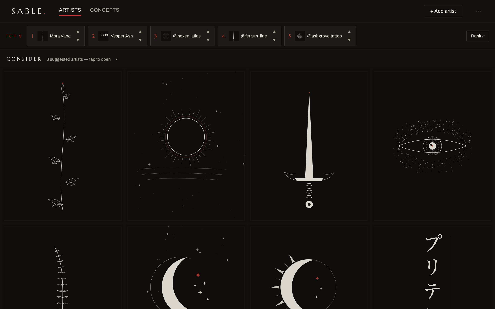
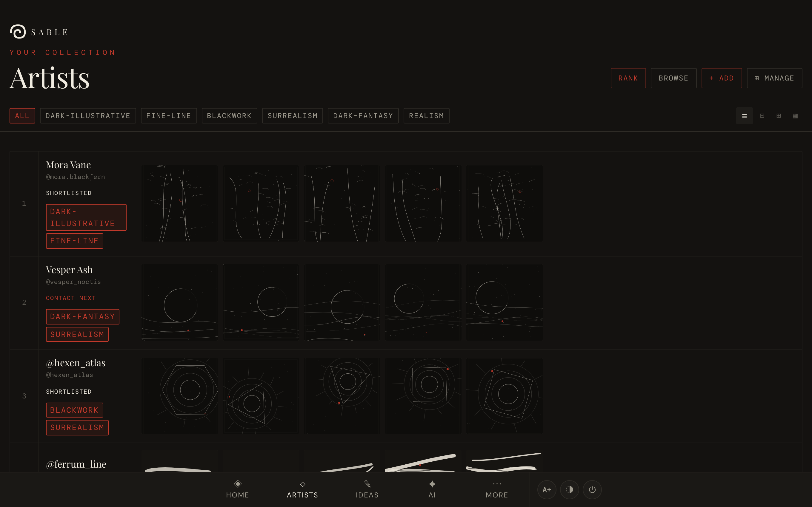
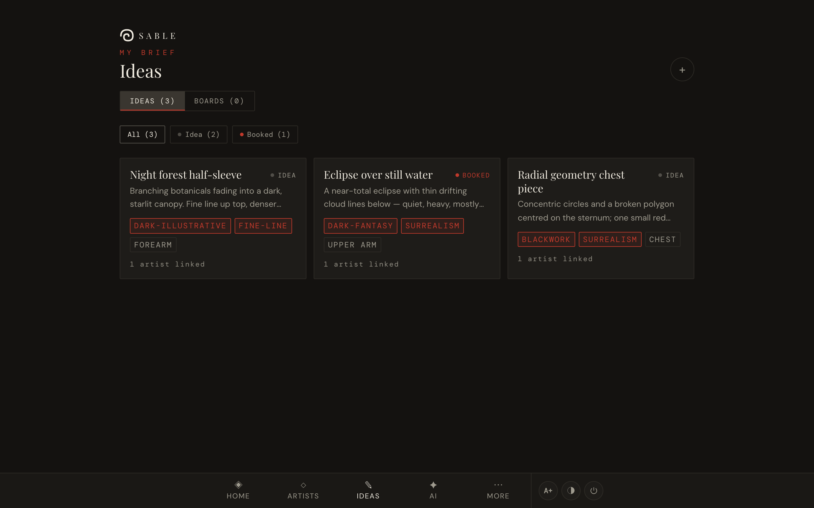
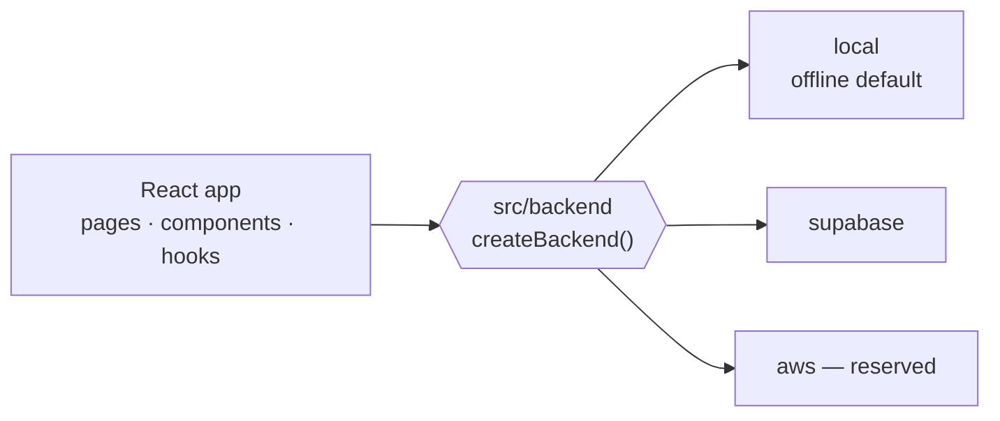

# Sable

[](https://github.com/Pritesh1980/sable/actions/workflows/ci.yml)
[](https://github.com/Pritesh1980/sable/actions/workflows/deploy-pages.yml)
[](https://github.com/Pritesh1980/sable/releases/latest)
[](https://pritesh1980.github.io/sable/?demo=1)

**Every tattoo artist you love, in one place.**

Sable gathers the artists you've collected — off Instagram, out of the camera roll — into a gallery built for browsing, then learns your taste by *looking* at their work instead of making you label it. It installs to your phone, works offline, and your reference images never leave the device.



- **One place, organised by artist.** Not two hundred saved posts — each artist's work, handle, styles and your own notes together on one card.
- **Built for looking.** Four ways through the collection (filmstrip, compare, grid, style wall) plus the Wall home. Their work at full size, on black.
- **It learns what you like.** Image embeddings computed on your device give every artist a visual fingerprint. Add someone new and Sable predicts roughly where they'd rank; open an artist and see who else in your collection sits closest to them.

Then as much depth as you want: a ranked shortlist, tattoo ideas linked to artists, copyable artist-ready briefs, mood boards, AI concept generation, and convention and studio context.

### Where it's heading

Not built yet — the direction the on-device taste model is aimed at:

- **Artists you haven't found yet.** Sable already models your taste from the collection you've ranked; the missing piece is a candidate pool to score against it.
- **Matches explained in your own reference points** — "sits between the artists you ranked #2 and #7" rather than a bare similarity score.
- **A style-space map**, where the collection clusters by real visual kinship instead of six hand-picked tags.

The full reasoning is in [docs/ai-vision.md](docs/ai-vision.md).

Sable is a local-first Progressive Web App, built for one obsessive collector's own planning — which is why it has opinions rather than settings. A live, backend-free demo runs on GitHub Pages; a real accounts + sync deployment (S3 + CloudFront) is left for later.

## Try the demo

**▶ [Live demo](https://pritesh1980.github.io/sable/?demo=1)** — no install, nothing to sign up for. It's the fully fictional dataset below, running entirely in your browser (local-first: nothing you do syncs anywhere).

The curated artist reference images are third-party portfolio work and are not in the repo, so a fresh clone would normally show monogram placeholders. Demo mode seeds a fully fictional dataset — invented artists with generated, committed artwork — so the app looks alive out of the box. To run it locally instead:

```bash
npm install
npm run dev
# then open:
#   http://localhost:5173/?demo=1
```

The sign-in screen also links straight to it (**No account? View the demo →**), so the bare URL isn't a dead end for anyone without an account. `?demo=1` (on the default local backend) signs in a demo session and seeds six fictional artists, ranked and statused, plus a few linked tattoo ideas. It never runs over an existing session (though an out-of-date demo session re-seeds itself, so returning visitors always see the current dataset), and edits you make in the demo persist across reloads. To reset, clear the site's storage (or use a fresh private window). The demo artwork is original, hand-authored SVG — one coherent tattoo style per artist (botanical, celestial, sacred geometry, bold blackwork, dotwork, and script lettering across katakana, hanzi and Gujarati).

| Artists gallery | Brief (ideas) |
| --- | --- |
|  |  |

## What It Includes

- **Wall (home)**: Top-5 dock with rank nudges, consider shelf, and a visual masonry of the collection.
- **Artists**: ranked artist gallery with four views — filmstrip, compare, grid, and style wall — plus browse and swipe-ranking modes.
- **Brief**: tattoo ideas with descriptions, placements, style tags, reference images, linked artists, and copyable artist-ready briefs.
- **Mood Boards**: grouped ideas that can be ordered and copied as a board brief.
- **Convention Radar**: curated UK convention shortlist with distances from Milton Keynes and artist attendance override support.
- **Studios**: artist grouping by studio and reachability.
- **AI Concepts**: multi-provider prompt packs (ChatGPT, Adobe Firefly, Gemini, Claude) built from free text or a Brief idea, paste-back of AI results as rated variants with a "Best" pick, optional in-app image generation via an OpenAI (DALL·E 3) or Gemini key with artist-style steering, relief STL export from image results, and style-based artist matching on each concept.
- **Manage**: artist CRUD, tags, statuses, studios, notes, image import, and backup/import.

## Tech Stack

- React 19
- Vite
- Tailwind CSS
- React Router
- Vitest + Testing Library
- Local-first storage: `localStorage` + IndexedDB, mirrored to a pluggable backend (see below)

## Architecture

Three ideas carry the design:

- **A vendor-SDK boundary.** The app never imports a persistence vendor SDK. All auth, document and blob access passes through `src/backend/`, where one factory selects an adapter set from `VITE_BACKEND` (`local` | `supabase` | `aws`). Changing provider means writing one new adapter, not editing app code.
- **Local-first sync.** `localStorage` and IndexedDB are the always-available cache; changes mirror to the backend and reconcile per record by last-write-wins on `updatedAt`. The UI never waits for a network.
- **On-device visual matching.** CLIP embeddings are computed in the browser, so building artist and concept matches never uploads the saved reference library.


```mermaid
flowchart LR
    APP["React app<br/>pages · components · hooks"]
    SEAM{{"src/backend<br/>createBackend()"}}
    LOCAL["local<br/>offline default"]
    SUPA["supabase"]
    AWS["aws — reserved"]
    APP --> SEAM
    SEAM --> LOCAL
    SEAM --> SUPA
    SEAM --> AWS
```

Because the local adapter is a complete offline stand-in rather than a stub, the whole
test suite runs with **no network or credentials**, and the public demo needs no account
backend or provider credentials.

📄 **[docs/ARCHITECTURE.md](docs/ARCHITECTURE.md)** has the detailed version: the full
write path with offline edits and tombstoned deletes, how images are kept out of synced
documents, the on-device taste model and the contract test that keeps it out of the
bundle, screenshot intake as a trust boundary, the service-worker strategy — and the
trade-offs taken deliberately, with the limits that are still open.

🧭 **[docs/USER-WORKFLOWS.md](docs/USER-WORKFLOWS.md)** maps the typical journeys:
discovering and ranking an artist, turning an idea into a brief, generating and refining
concepts, planning contact and travel, and continuing safely through offline work or
restore.

## Testing philosophy

The project is built TDD-first: behaviour is specified in a failing test before implementation, and any change to seed data must keep the data-integrity tests green. The suite is 915 Vitest tests across 104 files (`src/test/`), covering pure data modules directly and hooks/components via Testing Library. A contract test (`src/test/readmeClaims.test.js`) asserts the file count exactly and bounds the claimed test total against the statically visible case declarations, with headroom for generated `it.each` cases. Non-bundled files that Vitest can't import — like the hand-rolled service worker — follow a pure-module + contract-test pattern: the logic lives in importable modules (`src/sw/precache.js`, `src/sw/swStrategy.js`) with unit tests, plus contract tests (`src/test/precache.test.js`, `src/test/swStrategy.test.js`) that read `public/sw.js` as text and assert its key invariants. The local adapter and an in-memory mock share a contract test (`src/test/backendContract.test.js`), proving the seam without provider credentials; the suite is pinned to the offline local backend so it runs without secrets or network — in CI too.

## Useful Commands

```bash
npm test          # run the Vitest suite once
npm run test:watch
npm run lint
npm run build
npm run preview
```

## Data And Storage

Seed data lives in `src/data/`, with the artist list in `src/data/artists.js` and the fictional demo dataset in `src/data/demoSeed.js`.

> **Artist images:** the curated reference images under `public/images/artists/`
> are third-party portfolio work and are **not** included in this repository.
> When they are absent (e.g. a fresh clone), the UI falls back to monogram
> placeholders via `src/components/ArtistImage.jsx`. The demo artwork under
> `public/images/demo/` is original hand-authored SVG and **is** committed.

Runtime edits are stored locally in the browser and mirrored to the selected backend:

- `localStorage`: artist metadata, ideas, boards, concepts, theme, font size, convention overrides
- IndexedDB: artist image arrays and blob bytes
- Device-local only (never synced): theme, font size, API keys

Use **Manage → Export Backup** before clearing browser data or doing larger data edits.
The JSON includes artists, ideas, boards, concepts, notes, ranks, tags, convention
overrides, and current image values. Inline `data:` images are embedded, but backend
image blobs are not fetched into the file; use account sync to move those between
devices.

## PWA Notes

The app includes `public/manifest.json`, app icons in `public/icons/`, and a service worker at `public/sw.js` (with build-time asset precaching injected by `scripts/precachePlugin.js`).

GitHub Pages publishes the backend-free demo under `/sable/`; the base-aware router,
assets, and service worker keep deep links and offline caching valid on that sub-path.
A real accounts-and-sync deployment on S3 + CloudFront remains planned.

## Development Notes

Follow the project convention in `AGENTS.md`: use TDD for new behavior, keep changes local-first unless deployment infrastructure exists, and do not build public sharing features until hosting is ready. Full workflow documentation lives in [`docs/`](docs/README.md).

For a reusable walkthrough of the repository's personal GitHub Projects workflow, see the [GitHub Backlog Setup Guide](docs/github-backlog-setup-guide.docx).

## Licence

All rights reserved — see [`LICENSE`](LICENSE). The code is published for
reference only; it is not licensed for reuse or redistribution.
