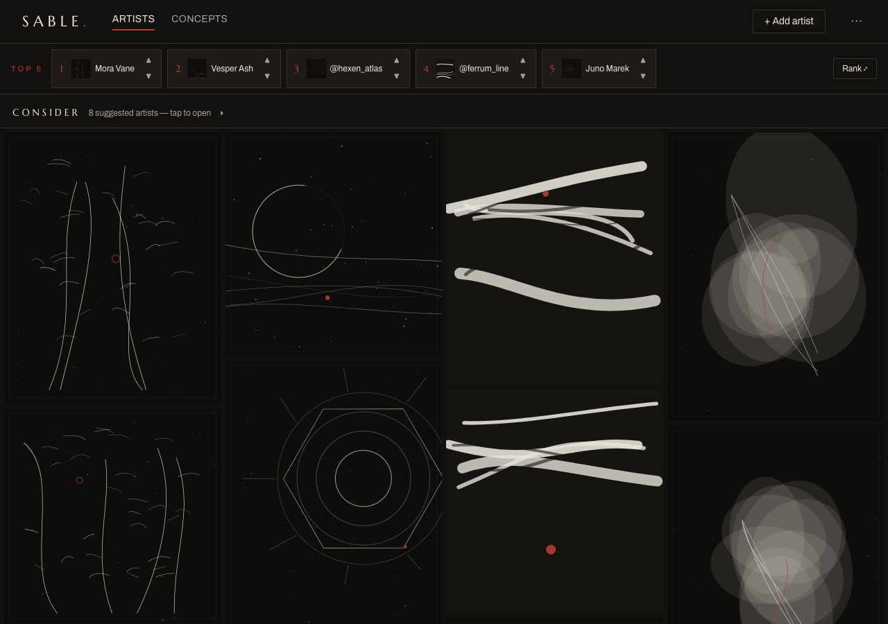
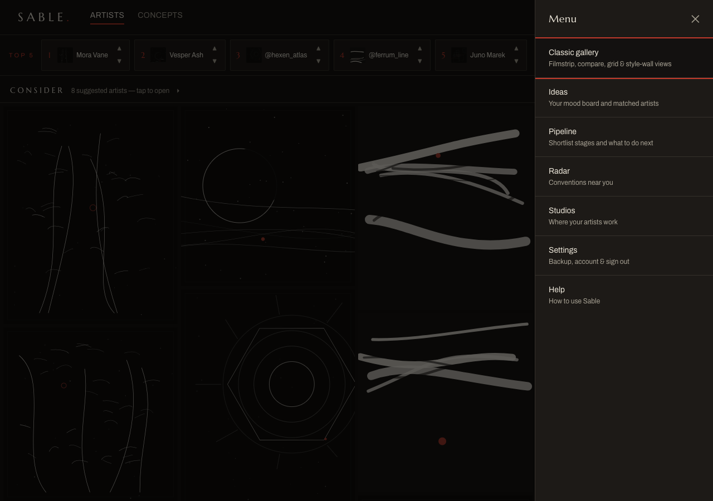

# Getting started

*The Wall, the full-screen viewer, and how to move around.*

← [Back to contents](README.md)

---

## The Wall — your artists, edge to edge

Open Sable and you're on **the Wall**: every photo from every artist in your collection,
tiled edge to edge. No panels, no stats — the work itself is the interface.

- **Hover a photo** to see whose it is — the artist's name (and their studio, when one
  is set) fades in along the bottom edge.
- A **red dot** on a photo means it's new — added within the last 14 days.
- Pinned just under the bar is your **Top 5** — the five artists you've ranked highest,
  as a slim strip. Nudge any of them up or down with **▲ / ▼**, or tap **Rank ⤢** to
  open the full ranking board (see [Gallery & ranking](03-gallery-and-ranking.md)).
- The thin bar at the top holds everything else: the **Artists / Concepts** switch,
  **+ Add artist**, and the **⋯** menu (the Drawer).
- At the very bottom of the Wall, a quiet **Consider** shelf suggests artists matched
  to the styles you already collect. Open the Instagram profile to judge for yourself,
  then **+ Add** (the form comes pre-filled) or **Not for me** (never suggested again).
  **Find more like this** asks AI for a fresh batch — those arrive marked *unverified*
  until you've looked at the profile. With a Gemini key saved, a **↻ Refresh** control
  in the shelf header re-runs AI discovery in one tap, skipping everyone you already
  have or have dismissed.

## The full-screen viewer — one click in

**Click any photo** and it fills the screen. This is the heart of the app: flick through
an artist's work, soak in the style, and jump straight to generating a concept in it.

The keyboard does the driving:

| Key | Does |
|---|---|
| `←` `→` | previous / next photo by **this artist** |
| `↑` `↓` | jump to the **previous / next artist** |
| `G` | **generate a concept** in this artist's style |
| `I` | open the artist's **info & notes** (status, notes, linked ideas) |
| `Esc` | back to the Wall |

A filmstrip of the artist's other photos sits along the bottom — click one to jump. The
artist's `@handle ↗` opens their Instagram in a new tab. Leave the mouse still for a couple
of seconds and the controls fade away, leaving just the image; move it and they return.

You can also **paste a screenshot** (`⌘V`) while viewing an artist — it's added to that
artist's photos and gets a red *new* dot on the Wall.

## Moving around

Sable has two primary spaces, switched from the bar on the Wall:

- **Artists** — the Wall and viewer, above.
- **Concepts** — your generated images, on the same kind of wall
  (see [AI concepts](06-concepts.md)).

Everything else lives in the **Drawer** — tap **⋯** at the top-right of the Wall:

- **Classic gallery** — the previous Artists page: filmstrip, compare, grid and style-wall
  views, ranking, and Manage mode.
- **Ideas** — tattoo ideas, with Boards as a tab.
- **Pipeline** — the shortlist dashboard (below).
- **Radar** — upcoming conventions. · **Studios** — where your artists work.
- **Settings** — backup, account & sign out. · **Help** — this guide, in the app.

On the classic pages the familiar bottom bar is still there — with the **A+ / A−**
text size, **◑ / ◐** theme and **⏻** sign-out controls at its right end.

## The Pipeline page

The old Home dashboard lives on at **Drawer → Pipeline**, unchanged: the Top 5 coverflow,
the shortlist pipeline (researching → shortlisted → contact next), idea stats and matches.
The viewer's `I` panel shows each artist's status in place, so you'll mostly need Pipeline
when planning outreach.

On a wide screen it spreads into a multi-column layout:

---

## What's already there

You don't start from a blank app:

- **Artists**, **Studios** and **Conventions** are pre-loaded so you can explore immediately.
- **Ideas**, **Boards** and **AI concepts** start empty — those are yours to build.

> **Tip:** your data syncs to your account, and **Drawer → Settings → Export Backup** gives
> you a restore point you control (see [Settings, backup & restore](07-backup-and-settings.md)).

---

Next: **[Managing artists →](02-managing-artists.md)**
