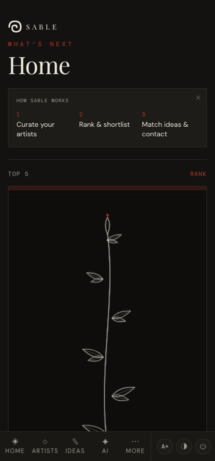
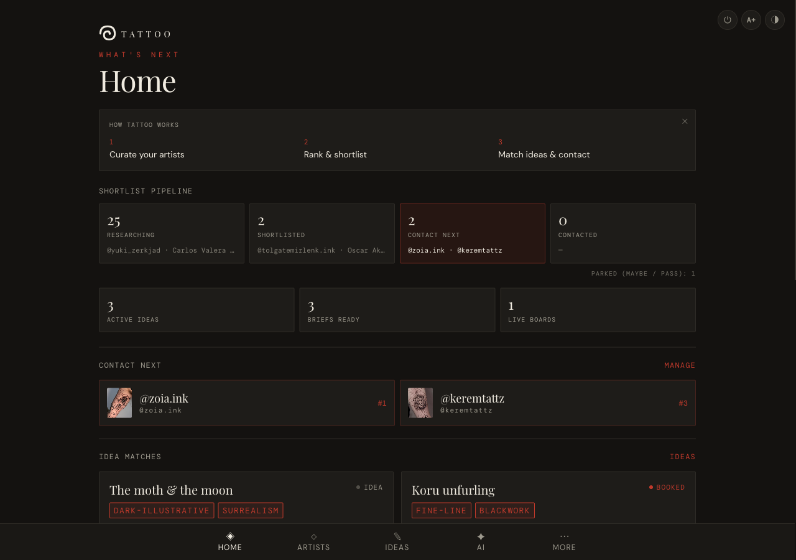

# Getting started

*The Home pipeline, how to move around, and the controls that are always within reach.*

← [Back to contents](README.md)

---

## Home — what's next

**Home** answers one question: *where is each artist in your shortlist, and what should
you do next?*

- **How Sable works** — a dismissible three-step strip of the core loop: curate your
  artists → rank & shortlist → match ideas & contact. Tap ✕ once you know your way around
  (it stays dismissed on that device).
- **Top 5** — the hero of Home: your five highest-ranked *current* artists (contacted and
  parked drop out), shown as a 3D coverflow of their artwork. Drag sideways or tap a card
  to bring it to the front; the focused artist's name, rank and status sit below it. Tap
  **Drop ↓** to move the focused artist out, or tap a name in *waiting in the wings* to
  pull them in — ranks reshuffle automatically. On devices without 3D (or with *reduced
  motion* set) it falls back to a flat artwork gallery with the same controls.
- **Shortlist pipeline** — three stage cards in workflow order: *Researching →
  Shortlisted → Contact next*, each with its count and top-ranked artists.
  *Contact next* is highlighted — that's your action stage. Artists you've already
  contacted, and ones parked as *Maybe* / *Pass*, show only as small counts under
  the strip — out of the way, but never silently gone.
- **Idea stats** — active ideas, briefs ready to share, and live boards, each linking
  into the Ideas page.
- **Contact next** — the artists you've marked *Contact next*, in rank order, with thumbnails.
- **Idea matches** — each idea paired with the artists whose styles overlap it, with a
  one-line rationale.

On a wide screen the same page spreads into a multi-column layout:

---

## Moving around

The bar pinned to the bottom of the screen mirrors the workflow:

- **Home** — what's next · **Artists** — curate & rank · **Ideas** — capture & match ·
  **AI** — generate concepts.
- **More (⋯)** opens a menu with **Radar** (conventions), **Studios**, **Settings** and **Help**.

## Text size & theme

Two controls sit at the top-right of every screen:

- **A+ / A−** — increase or decrease text size.
- **◑ / ◐** — switch between dark and light themes.
- **⏻** — sign out (clears this device's copy; everything syncs back on sign-in).

---

## What's already there

You don't start from a blank app:

- **Artists**, **Studios** and **Conventions** are pre-loaded so you can explore immediately.
- **Ideas**, **Boards** and **AI concepts** start empty — those are yours to build.

> **Tip:** your data syncs to your account, and **More → Settings → Export Backup** gives
> you a restore point you control (see [Settings, backup & restore](07-backup-and-settings.md)).

---

Next: **[Managing artists →](02-managing-artists.md)**
