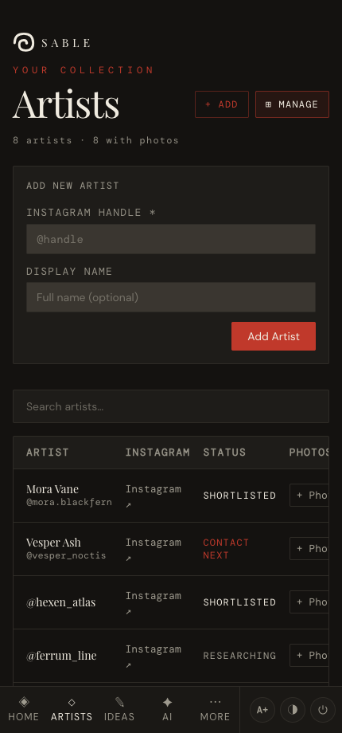
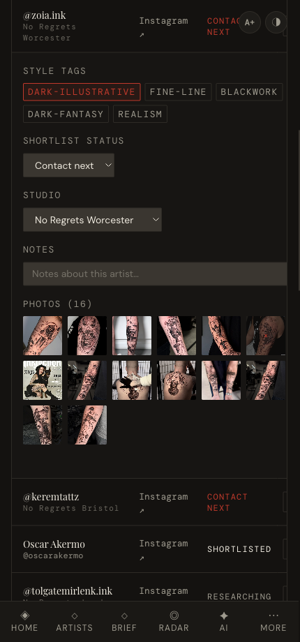

# Managing artists

*Add artists to your collection and give each one photos, style tags, a status, a studio and notes.*

← [Back to contents](README.md)

---

Everything to do with the artist list itself lives on the **Artists** page — tap the
**Manage** button in the header (or deep-link to `/gallery?mode=manage`). A count of
artists and photos sits at the top.

## Add an artist — the quick way

Tap **+ Add** in the Artists header (visible in every view). One small form does the
whole onboarding:

1. Paste the **Instagram handle or the full Instagram URL** — the handle is extracted
   automatically.
2. Optionally add a **display name** (e.g. *Carlos Valera* for `@carl245tattoo`).
3. Toggle their **style tags** and pick a **shortlist status** right there.
4. Tap **Add Artist** — they land at the bottom of your ranking, fully tagged.

Duplicate handles are rejected with a message, so you can't add the same artist twice.
The **Add New Artist** panel inside Manage mode still works too (and also accepts URLs).

## The artist table

Below the add-artist panel is a searchable table of every artist with their Instagram
link, status and photo count. Type in the **search** box to filter by name or handle.

## Edit an artist

**Tap a row to expand it.** You get everything for that artist in one place:

- **Style tags** — tap to toggle (`dark-illustrative`, `fine-line`, `blackwork`,
  `surrealism`, `dark-fantasy`, `realism`). These power the matching in *Ideas* and *AI*.
- **Shortlist status** — `Researching`, `Shortlisted`, `Contact next`, `Contacted`,
  `Maybe`, `Pass`. *Contact next* feeds Home's pipeline and "Contact next" list.
- **Studio** — pick where they work; this populates the [Studios](05-conventions-and-studios.md) page.
- **Notes** — free text; saves when you tap away or press Enter.
- **Photos** — tap **+ Photos** to upload screenshots (they're compressed automatically).
  Hover/tap a thumbnail's **×** to remove it.
- **Remove artist** — deletes them from your collection (with a confirmation).

> **Tip:** you can also upload photos and edit tags/status/studio from an artist's full
> detail card in the [gallery views](03-gallery-and-ranking.md) — whichever is handier.
> Tap **Manage** again to flip back to the visual views. Backups now live in
> [More → Settings](07-backup-and-settings.md).

---

Next: **[Gallery & ranking →](03-gallery-and-ranking.md)**
