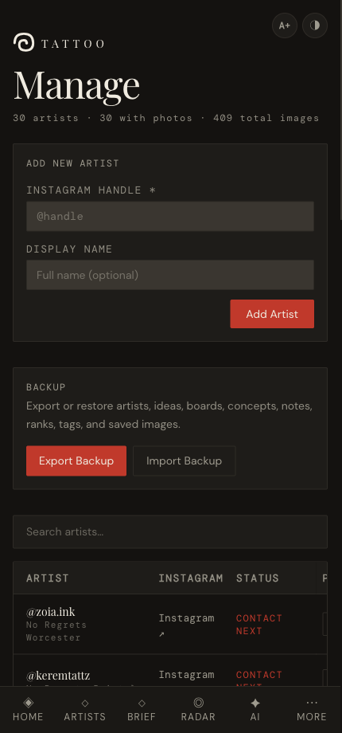

# Managing artists

*Add artists to your collection and give each one photos, style tags, a status, a studio and notes.*

← [Back to contents](README.md)

---

Everything to do with the artist list itself lives in **More → Manage**. The header shows
a running count of artists, how many have photos, and total images.

## Add an artist

1. In the **Add New Artist** panel, type the **Instagram handle** (the `@` is optional).
2. Optionally add a **display name** (e.g. *Carlos Valera* for `@carl245tattoo`).
3. Tap **Add Artist**. They appear at the bottom of the list, ready to fill in.

> Duplicate handles are ignored, so you can't accidentally add the same artist twice.

## The artist table

Below the backup panel is a searchable table of every artist with their Instagram link,
status and photo count. Type in the **search** box to filter by name or handle.

## Edit an artist

**Tap a row to expand it.** You get everything for that artist in one place:

- **Style tags** — tap to toggle (`dark-illustrative`, `fine-line`, `blackwork`,
  `surrealism`, `dark-fantasy`, `realism`). These power the matching in *Brief* and *AI*.
- **Shortlist status** — `Researching`, `Shortlisted`, `Contact next`, `Contacted`,
  `Maybe`, `Pass`. *Contact next* feeds the dashboard's "Next artists" list.
- **Studio** — pick where they work; this populates the [Studios](05-conventions-and-studios.md) page.
- **Notes** — free text; saves when you tap away or press Enter.
- **Photos** — tap **+ Photos** to upload screenshots (they're compressed automatically).
  Hover/tap a thumbnail's **×** to remove it.
- **Remove artist** — deletes them from your collection (with a confirmation).

> **Tip:** you can also upload photos and edit tags/status/studio from an artist's full
> detail card in the [Gallery](03-gallery-and-ranking.md) — whichever is handier.

---

Next: **[Gallery & ranking →](03-gallery-and-ranking.md)**
