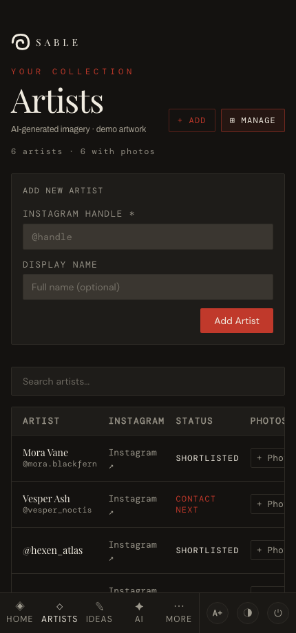
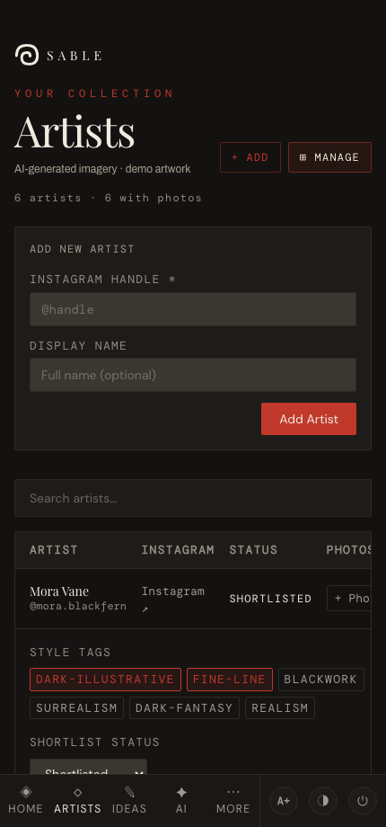

# Managing artists

*Add artists to your collection and give each one photos, style tags, a status, a studio and notes.*

← [Back to contents](README.md)

---

## Add an artist — the quick way

Tap **+ Add artist** in the Wall's top bar (the empty Wall offers the same button). One
small form does the whole onboarding:

1. Paste the **Instagram handle or the full Instagram URL** — the handle is extracted
   automatically.
2. Optionally add a **display name** (e.g. *Carlos Valera* for `@carl245tattoo`).
3. Toggle their **style tags**.
4. **Drop or paste a few screenshots** right in the form if you have them handy.
5. Save — their photos join the Wall immediately, each wearing a red *new* dot.

If the handle already exists, Sable offers to **add the images to that artist** instead of
creating a duplicate.

### Auto-fill from a screenshot

Both add forms — the Wall's **+ Add artist** and the Artists page's **+ Add** — can fill
themselves from an Instagram screenshot. Drop, paste or choose one and, with a Gemini key
set (Concepts → AI setup), the handle and name are read from the screenshot, style tags
are suggested from the artwork itself, and a draft style note is written for you to edit.
The screenshot becomes the artist's first reference image. If you've built the on-device
style index, you also get a **taste fit** score for the screenshot before you even add
them — a first read on whether this artist belongs in your collection. Without a key, the
screenshot still attaches; you fill in the details yourself. The **Full manage view** link in the form's footer jumps to the
heavy-duty editor below.

### Share a screenshot straight from Instagram

Sable installs as a share destination, so a screenshot can go from Instagram into the
add-artist form without saving it to your camera roll first.

**Android / desktop Chrome.** Install Sable to your home screen, then **Share → Sable**
from anywhere. The screenshot lands in the add-artist form with auto-fill already
running.

**iPhone.** Safari doesn't support apps registering as share destinations
([WebKit bug 194593](https://bugs.webkit.org/show_bug.cgi?id=194593)), so iOS needs a
one-off Shortcut instead. In the Shortcuts app:

1. New Shortcut → turn on **Show in Share Sheet**, and set *Accepted Types* to **Images**
2. Add **Copy to Clipboard** (input: Shortcut Input)
3. Add **Open URL** → `https://pritesh1980.github.io/sable/share`
4. Name it **Sable**

Now from Instagram: **Share → Sable**, then paste (long-press → Paste) into the form that
opens. The screenshot is already on your clipboard, so it's one tap plus a paste.

Either way the form opens ready — with a Gemini key set, auto-fill runs as soon as the
screenshot is attached.

## Add photos as you find them

You don't need a form to grow a portfolio:

- **Drag an image file onto an artist's photo on the Wall** — the tile highlights, and the
  drop adds the image to that artist.
- **Paste (`⌘V`) while viewing an artist full-screen** — the screenshot is added to
  whichever artist is on screen.

Either way the new photo is stamped as recent and wears a red dot for two weeks.

## The manage table

Deeper upkeep lives on the classic Artists page — **⋯ → Classic gallery**, then the
**Manage** button in the header (or deep-link to `/gallery?mode=manage`). A count of
artists and photos sits at the top.

The **Add New Artist** panel inside Manage mode still works too (and also accepts URLs,
plus a shortlist status).

Below the add-artist panel is a searchable table of every artist with their Instagram
link, status and photo count. Type in the **search** box to filter by name or handle.

## Edit an artist

**Tap a row to expand it.** You get everything for that artist in one place:

- **Style tags** — tap to toggle (`dark-illustrative`, `fine-line`, `blackwork`,
  `surrealism`, `dark-fantasy`, `realism`). These power the matching in *Ideas* and *AI*.
- **Shortlist status** — `Researching`, `Shortlisted`, `Contact next`, `Contacted`,
  `Maybe`, `Pass`. *Contact next* feeds Home's pipeline and "Contact next" list.
- **Studio** — pick where they work; this populates the [Studios](05-conventions-and-studios.md) page.
- **Notes** — free text; saves when you tap away or press Enter.
- **Photos** — tap **+ Photos** to upload screenshots (they're compressed automatically).
  Tap a thumbnail's **×** to remove it — the × is always visible on touch, and appears
  on hover with a mouse. There's no confirmation prompt; instead a **Photo removed —
  Undo** bar appears for a few seconds, and Undo puts the photo back where it was.
- **Remove artist** — deletes them from your collection (with a confirmation).

> **Tip:** you can also upload photos and edit tags/status/studio from an artist's full
> detail card in the [gallery views](03-gallery-and-ranking.md) — whichever is handier.
> Tap **Manage** again to flip back to the visual views. Backups now live in
> [More → Settings](07-backup-and-settings.md).

---

Next: **[Gallery & ranking →](03-gallery-and-ranking.md)**
