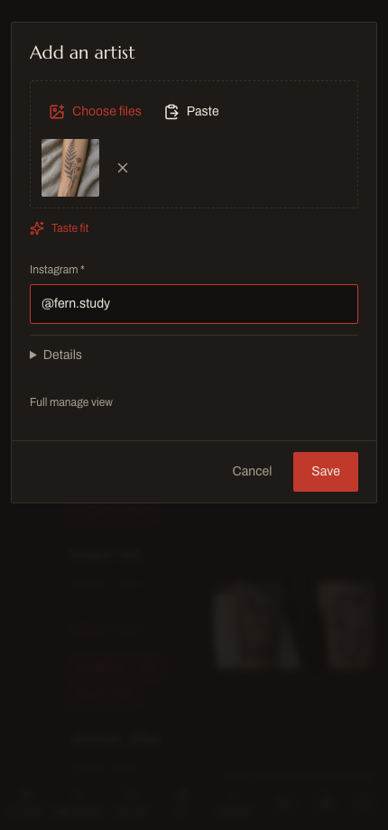
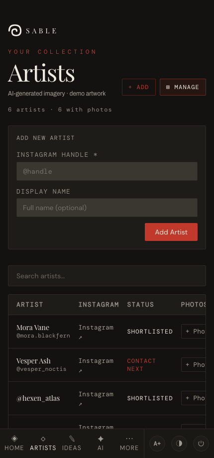
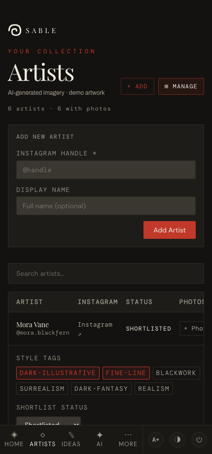

# Managing artists

*Add artists to your collection and give each one photos, style tags, a status, a studio and notes.*

← [Back to contents](README.md)

---

## Add an artist — the quick way

Tap **+ Add artist** on the Wall or **+ Add** on the Artists page. Both open the
same capture form.

1. **Choose files**, drop or paste screenshots if you have them. Several photos can
   be attached before you enter a handle. **Paste** reads the clipboard only when tapped.
2. Enter an **Instagram handle or profile link**, such as `@mora.blackfern` or
   `https://www.instagram.com/mora.blackfern/`. Post, reel and story links are
   rejected: they do not identify the artist.
3. Tap **Save**. No optional metadata is required; the default status is Researching.

**Details** starts collapsed and holds display name, tags, status and a style note.
You can add or edit those later. **Artist saved** confirms the local library update;
it does not claim cloud sync or an off-device backup.

For an existing handle, attach photos and tap **Add images to … instead**. Sable
preserves the artist's existing details and confirms the number of photos added.
With no photos, **Already in your collection** appears and the append action is disabled.

Cancel, Escape, a backdrop tap and **Full manage view** ask before discarding an
edited capture. Declining keeps the fields and photos. During Save, dismissal and
repeat submission are disabled; an error leaves the capture open for retry. This
protection applies while the form is open, not to reload, sign-out or app termination.

### Auto-fill from a screenshot

Attaching a photo never starts an AI request. With a Gemini key saved
(Concepts → AI setup), tap **Auto-fill** to analyse the first staged screenshot.
This sends that image to Gemini and may incur provider charges. It suggests a
handle, name, tags and style note without overwriting your edits.

The same analysis locates the artwork and crops it on your device. **Use the whole
screenshot** restores the original if the crop clips something you wanted. Where an
on-device style index already exists, the form can also show a taste-fit score.
Without a key, photos remain uncropped and manual capture works normally; the
optional **Taste fit** action scores the whole screenshot and marks it rough.

### Share from Instagram

**Android / desktop Chrome.** An installed Sable app accepts shared image files.
**Share → Sable** opens capture with the photo attached, ready for a manual handle
or an explicit Auto-fill tap. This image-share route does not import shared text.

**iPhone.** Use a one-off Shortcut and then paste into Sable. Settings shows
**Install Share to Sable** only when an actual iCloud Shortcut link is configured.
No signed Shortcut is bundled with this repository; without a link, use the setup
guide and build it manually:

1. New Shortcut → **Show in Share Sheet** → accept **Images, URLs and Text**.
2. **Copy to Clipboard**, using Shortcut Input. If Instagram shares multiple items,
   select the intended screenshot or profile link first rather than combining them.
3. **Open URL** → your deployment's fixed share address. For the public demo this is
   `https://pritesh1980.github.io/sable/share`; a root deployment uses `/share`.
   Do not put screenshot bytes or the shared text into the URL.
4. Name it **Sable**.

After **Share → Sable**, tap **Paste** in capture. If clipboard image reading is
unavailable or denied, **Choose files** still works; for a profile link, long-press
the Instagram field and paste there. A screenshot needs the artist's handle unless
you explicitly use Auto-fill.

**Real-iPhone acceptance is pending.** The recipe can open Safari rather than the
installed home-screen app, which may mean a different session or local library.
Use the intended Sable context; do not assume your library has transferred between
them. Desktop browser tests do not verify that phone handoff.

## Add photos as you find them

You don't need a form to grow a portfolio:

- **Drag an image file onto an artist's photo on the Wall** — the tile highlights, and the
  drop adds the image to that artist.
- **Paste (`⌘V`) while viewing an artist full-screen** — the screenshot is added to
  whichever artist is on screen.

Either way the new photo is stamped as recent and wears a red dot for two weeks.

## The manage table

Deeper upkeep lives on the classic Artists page — **⋯ → Classic gallery**, then the
**Manage** button in the header (or deep-link to `/gallery?mode=manage`). A count of
artists and photos sits at the top.

The **Add New Artist** panel inside Manage mode still works too (and also accepts URLs,
plus a shortlist status).

Below the add-artist panel is a searchable table of every artist with their Instagram
link, status and photo count. Type in the **search** box to filter by name or handle.

## Edit an artist

**Tap a row to expand it.** You get everything for that artist in one place:

- **Style tags** — tap to toggle (`dark-illustrative`, `fine-line`, `blackwork`,
  `surrealism`, `dark-fantasy`, `realism`). These power the matching in *Ideas* and *AI*.
- **Shortlist status** — `Researching`, `Shortlisted`, `Contact next`, `Contacted`,
  `Maybe`, `Pass`. *Contact next* feeds Home's pipeline and "Contact next" list.
- **Studio** — pick where they work; this populates the [Studios](05-conventions-and-studios.md) page.
- **Notes** — free text; saves when you tap away or press Enter.
- **Photos** — tap **+ Photos** to upload screenshots (they're compressed automatically).
  Tap a thumbnail's **×** to remove it — the × is always visible on touch, and appears
  on hover with a mouse. There's no confirmation prompt; instead a **Photo removed
  from <artist> — Undo** bar appears for a few seconds, and Undo puts the photo back
  where it was. The bar sticks around even if you collapse the row, so you can still
  take it back — and only ever one shows at a time, so removing a second photo
  commits the first.
- **Remove artist** — deletes them from your collection (with a confirmation).

> **Tip:** you can also upload photos and edit tags/status/studio from an artist's full
> detail card in the [gallery views](03-gallery-and-ranking.md) — whichever is handier.
> Tap **Manage** again to flip back to the visual views. Backups now live in
> [More → Settings](07-backup-and-settings.md).

---

Next: **[Gallery & ranking →](03-gallery-and-ranking.md)**
