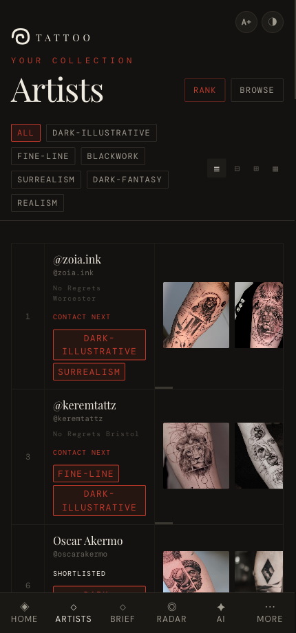
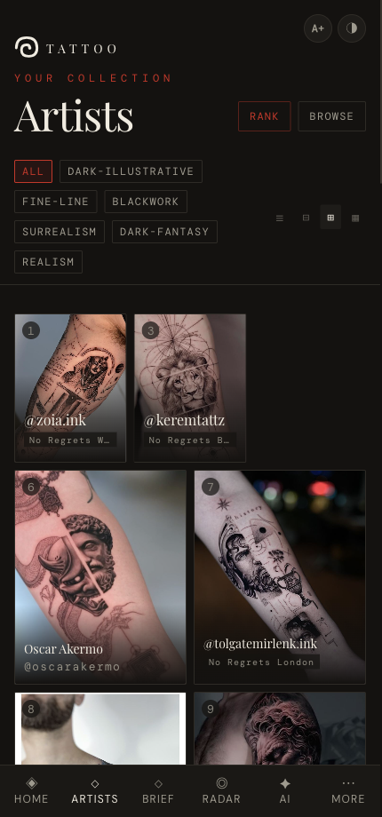
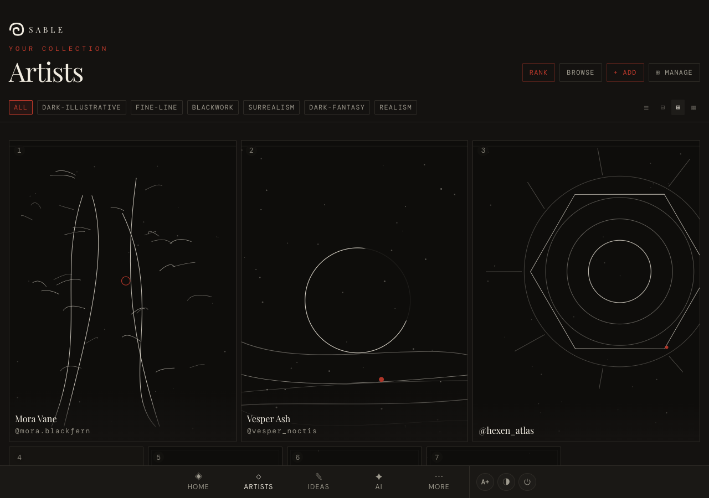
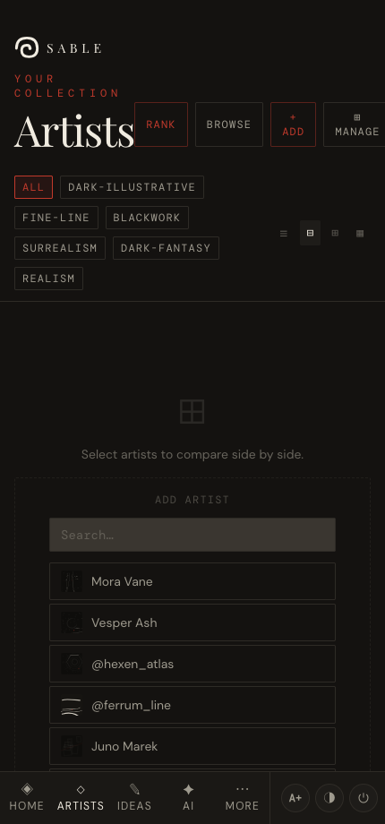
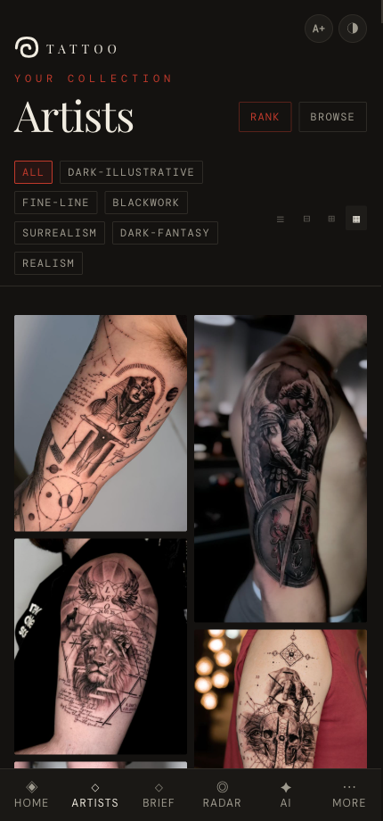
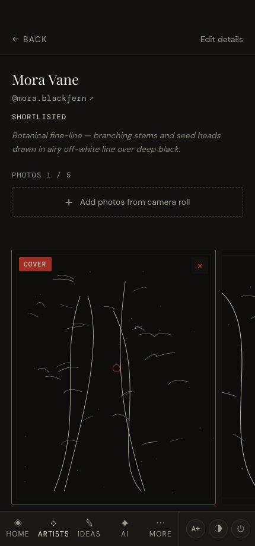
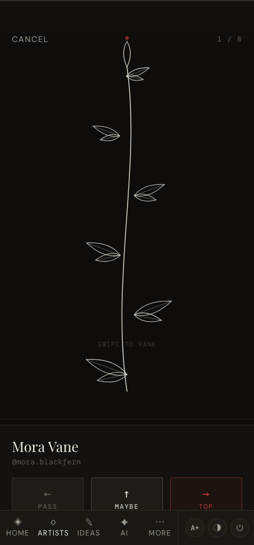

# Gallery & ranking

*Browse your collection four different ways, filter by style, open any artist, and put them in priority order.*

← [Back to contents](README.md)

---

The **Classic gallery** (**⋯ → Classic gallery**) is where structured browsing lives — the
Wall is for looking, this page is for organising. A sticky bar at the top holds the
**style filter** (tap a tag to show only artists with it; tap **All** to clear) and a
**view toggle** on the right with four modes. (Everyday ranking now lives on the Home
Wall — see [Ranking your favourites](#ranking-your-favourites) below.)

## The four views

### ☰ Filmstrip
A scrollable row per artist — rank controls on the left, details and a strip of their work
on the right.

### ⊞ Grid
A visual grid with your top three featured large. **Drag a card** to reorder — its new
position becomes its rank.

On a wider screen the grid expands to show more artists per row:

### ⊟ Compare
Add up to four artists side by side to weigh them against each other, portfolios and all.

### ▦ Style Wall
An edge-to-edge wall of everyone's work — pure visual browsing.

---

## Opening an artist

Tap any card to open the full **artist detail**: a photo carousel, their tags, status,
studio, notes, and any conventions they're attending. Tap **Edit details** to change them.

### Similar ink

Below the style tags, the detail view can show the three artists in your collection
whose work looks most alike — matched on the images themselves, not just tags. The
first time, tap **Build style index**: a small vision model is downloaded once and
every comparison then runs entirely on your device (your images never leave the
browser). Indexing the whole collection takes a minute or two; after that it only
processes newly added photos, and each device keeps its own index. Tap a match to
jump to that artist.

---

## Ranking your favourites

Everything below sets the **same single ranking** — one ordered list of every artist.

The quickest place to rank is the **Home Wall**. Your **Top 5** is pinned at the top:
nudge any of the five up or down with **▲ / ▼**, or tap **Rank ⤢** to open the full
**ranking board** — your Top 5 pinned up top, everyone else below, with **▲ / ▼** on
every row, **Drop ↓** to push an artist out of the Top 5, and **↑ To top 5** to pull one
in. Close it (or press **Esc**) to return to the Wall.

The Classic gallery keeps its own ranking tools for when you're already there organising:

1. **Drag** in Grid view.
2. **Nudge** the rank number up/down in Filmstrip view.
3. **Swipe-compare** — tap **Rank** (top-right of the Artists page) to judge artists one at
   a time as **Pass / Maybe / Top**. Made a mistake? **Undo** reverses your last decision.

> **Tip:** ranking flows through the whole app — the Home **Top 5** and **Contact next**,
> and the artist suggestions in *Brief*, all respect the order you set here.

---

Next: **[Brief & boards →](04-brief-and-boards.md)**
