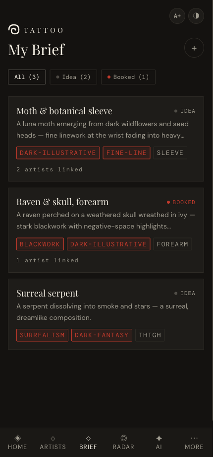
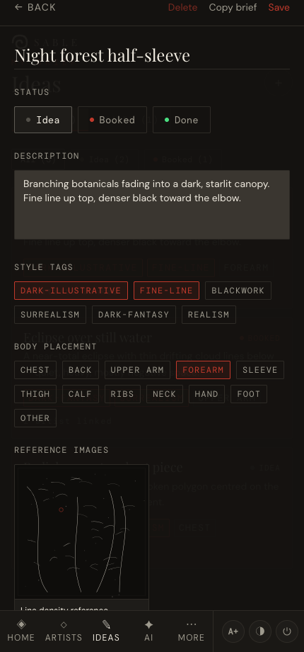
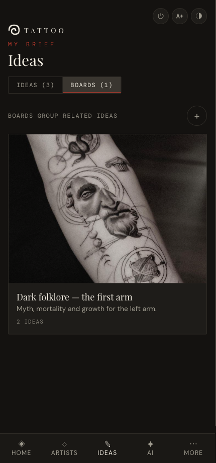
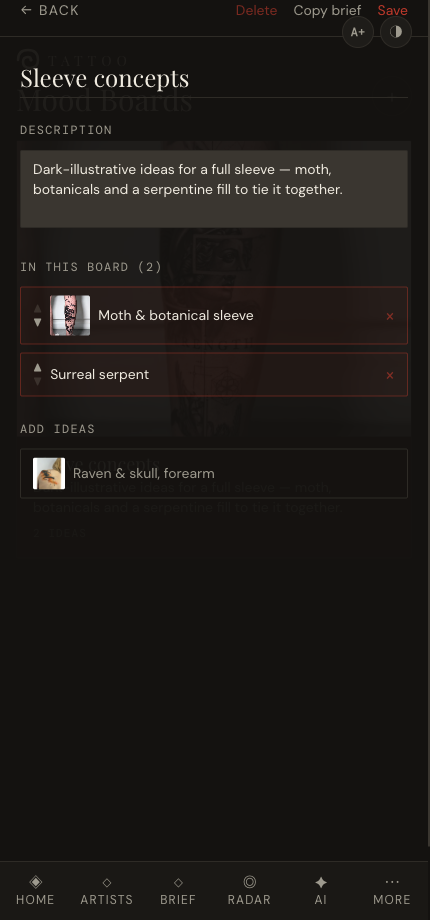

# Ideas & boards

*Capture tattoo ideas, link the artists who suit them, and group related ideas into mood boards you can share.*

← [Back to contents](README.md)

---

## Your Brief

**Brief** is your collection of tattoo ideas. Each card shows the title, a snippet, style
tags, placement and how many artists are linked. The tabs at the top filter by status
(**All / Idea / Booked / Done**).

### Create or edit an idea

Tap **+** to add an idea (or tap a card to edit one). The editor gives you:

- **Title** and **description**.
- **Status** — Idea, Booked or Done.
- **Style tags** — the same six styles used across the app.
- **Body placement** — chest, forearm, sleeve, etc.
- **Fill idea from image** — with a Gemini key set and at least one uploaded reference
  image, this button drafts the title, description, style tags and placement from the
  image itself; only fields you haven't filled are touched.
- **Reference images** — paste an image URL or upload photos, each with a note on *what to
  borrow from it*.

### Artists match automatically

As soon as an idea has style tags, the editor shows **matching artists**, ranked by how
many tags overlap, their shortlist status and their rank. **Tap an artist to link them**
to the idea. (Before any tags are set, you'll see lighter *suggestions* instead.)

When you're ready to share, tap **Copy brief** — a clean, formatted summary of the idea
and its linked artists goes to your clipboard, ready to paste to an artist.

---

## Mood boards

**Boards** (the second tab on the Ideas page) group related ideas into a themed collection — handy for a
sleeve or a connected set of pieces. The board's cover is taken from its first idea's image.

### Build a board

Tap **+** (you need at least one idea first). In the board editor you can:

- Give the board a **name** and **description**.
- **Add ideas** from the list at the bottom; **reorder** them with the ▲ ▼ arrows; remove
  one with **×**.
- **Copy brief** to export the whole board — every idea plus its linked artists — as text.

> **Tip:** deleting a board never deletes the ideas inside it.

---

Next: **[Conventions & studios →](05-conventions-and-studios.md)**
