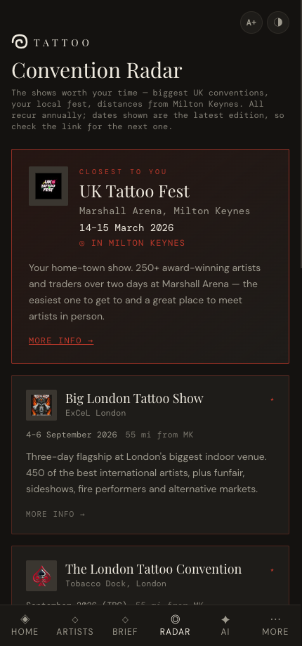
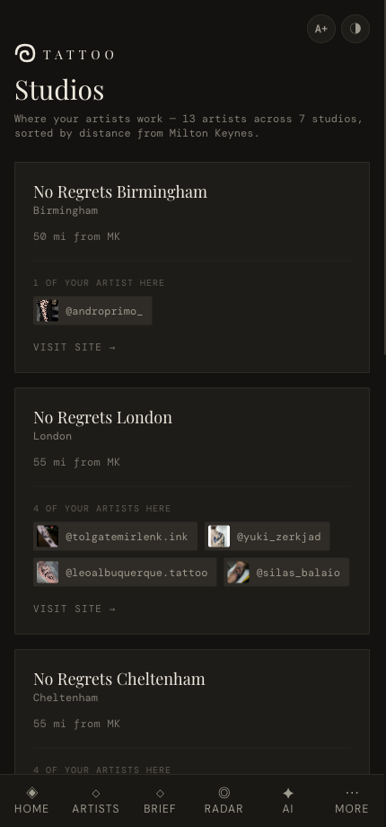

# Conventions & studios

*See which tattoo conventions are worth the trip, and where your saved artists actually work.*

← [Back to contents](README.md)

---

## Convention Radar

**Radar** lists notable UK tattoo conventions, **nearest to Milton Keynes first**. The
closest show is highlighted as a hero card at the top.

Each card shows the venue, dates, distance from Milton Keynes, a short summary, and a link
to the event's site. Popular shows are marked with a ★.

> Conventions recur annually — the dates shown are for the latest known edition, so follow
> the link for the next one.

---

## Studios

**Studios** (More → Studios) groups your saved artists by the studio they work at, **sorted
by distance**, so you can see which are realistically reachable and who you could see where.

- Only studios that have at least one of *your* artists appear.
- Each card lists those artists as chips — **tap a chip to open their Instagram**.
- **Visit site** links to the studio's page where known.

An artist shows up here once you've set their **Studio** field — do that from
[Manage](02-managing-artists.md) or the artist's detail card.

---

## How it all cross-references

These two pages aren't islands — the connections surface throughout the app:

- When an artist is attending a convention, you'll see it on their **detail card** and on
  the **dashboard**, and inside the **idea editor**'s artist matches.
- A studio assignment in *Manage* is what places an artist on the *Studios* page.

---

Next: **[AI concepts →](06-concepts.md)**
