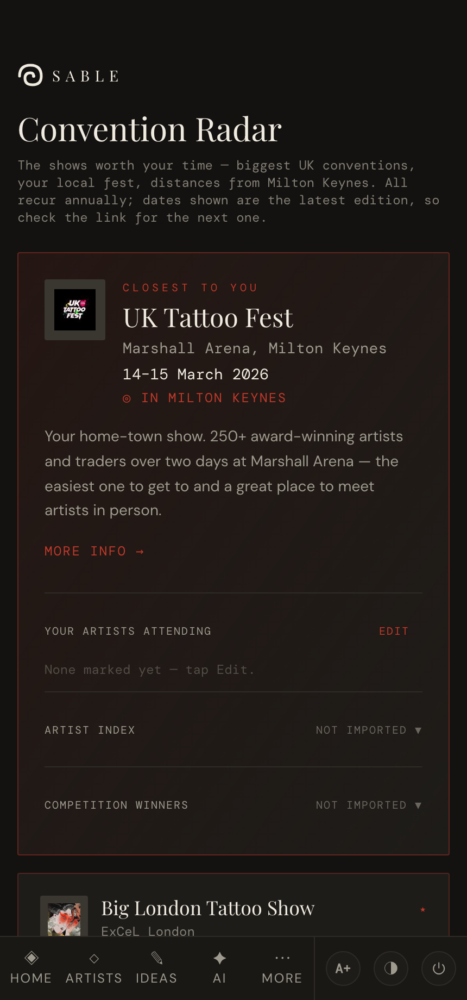
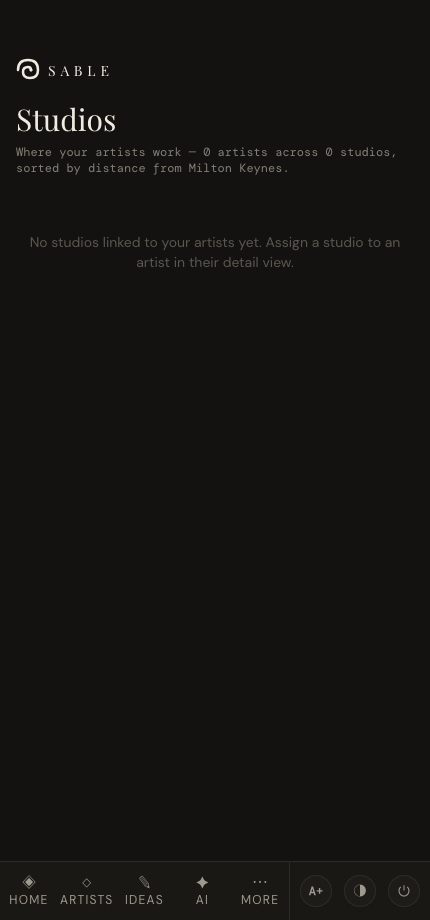

# Conventions & studios

*See which tattoo conventions are worth the trip, and where your saved artists actually work.*

← [Back to contents](README.md)

---

## Convention Radar

**⋯ → Radar** lists notable UK tattoo conventions, **nearest to Milton Keynes first**. The
closest show is highlighted as a hero card at the top.



Each card shows the venue, dates, distance from Milton Keynes, a short summary, and a link
to the event's site. Popular shows are marked with a ★.

**Mark who's going.** Each card has a *Your artists attending* line — tap **Edit** to toggle
which of your saved artists are appearing at that show. Those names then surface on the
artist's detail card, on the Pipeline page, and next to the artist in idea matches. (Automatic look-up is
on the backlog; for now you set this yourself.)

> Conventions recur annually — the dates shown are for the latest known edition, so follow
> the link for the next one.

### Artist index

A big show publishes hundreds of artists — the Big London Tattoo Show fields around 500 —
as one long alphabetical list. **Artist index** on each convention card turns that list into
something you can work from the sofa or the show floor.

#### Grab it automatically (recommended)

Show sites load their artist list *as you scroll*, so selecting it by hand means thumbing all
500 artists into view first. The **grabber** does that for you — a bookmarklet that scrolls the
page, reads every artist off it, and sends the list straight back to Sable.

One-time setup:

1. In the artist index, tap **Copy the grabber**.
2. In Safari, bookmark any page — then edit that bookmark, rename it *Grab line-up*, and
   replace its **address** with what you copied.

Then, for any show:

1. Open the show's artist list.
2. Tap the **Grab line-up** bookmark. It scrolls the whole list (a few seconds) and shows
   *Sable found N artists*.
3. Tap **Import N artists into Sable** — the list lands in that show's index, and Sable
   confirms what arrived.

On a Mac you can skip the bookmark and paste the grabber into the browser console on the
artist list page instead. The grabber only reads the page you run it on, and only ever hands
data to Sable itself.

#### Or paste it in

Tap **Artist index → the show's artist list**, select the names on the show's page and paste
them into the box, one artist per line. Handles are optional; these all parse:

```
Oscar Akermo @oscarakermo
@kubalizmus
Carlos Valera (@carl245tattoo) — No Regrets, Cardiff
https://instagram.com/zoia.ink
Martin Kubala
```

Index letters, nav links and blank lines are ignored, and duplicates collapse. Nothing is
sent anywhere — the list is parsed on the device.

**Then work it.** The card header shows *N artists · M in your gallery*. Inside you can:

- **Search** by name, handle or the studio/country detail.
- Filter to **In your gallery** (who you already follow is going) or **New to you**.
- **Add** an artist straight to your gallery — they land as *researching* and are flagged
  as attending that show in one tap. Style tags stay empty: the show's list says nothing
  about style, so you tag them yourself once you've looked at their work.
- Tap **Attending?** on an artist you already have to flag them for that show — the same
  flag the *Your artists attending* line sets.

A later import **merges** rather than replaces, so re-pasting an updated line-up keeps
everything you'd already worked through. **Clear list** removes it. The line-up is stored on
this device only (it's re-importable in seconds); the artists you add from it sync as normal.

---

## Studios

**Studios** (⋯ → Studios) groups your saved artists by the studio they work at, **sorted
by distance**, so you can see which are realistically reachable and who you could see where.



- Only studios that have at least one of *your* artists appear.
- Each card lists those artists as chips — **tap a chip to open their Instagram**.
- **Visit site** links to the studio's page where known.

An artist shows up here once you've set their **Studio** field — do that from
[Manage](02-managing-artists.md) or the artist's detail card.

---

## How it all cross-references

These two pages aren't islands — the connections surface throughout the app:

- When an artist is attending a convention, you'll see it on their **detail card** and on
  the **dashboard**, and inside the **idea editor**'s artist matches.
- A studio assignment in *Manage* is what places an artist on the *Studios* page.

---

Next: **[AI concepts →](06-concepts.md)**
