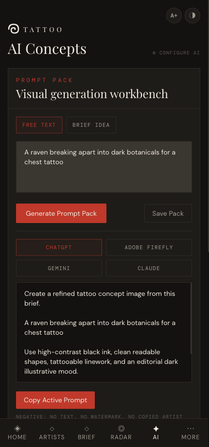
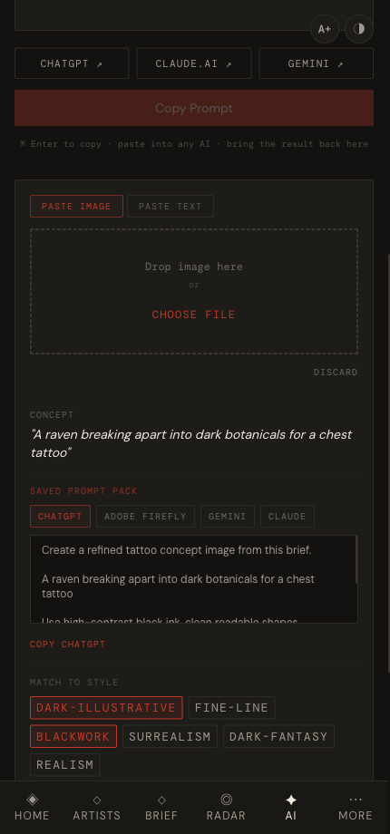

# AI concepts

*Turn rough tattoo ideas into prompt packs, saved AI results, and artist matches.*

← [Back to contents](README.md)

---

**AI** is a sketchpad and prompt workbench for concepts. You can turn a short idea
or an existing Brief idea into provider-specific prompts for ChatGPT, Adobe Firefly,
Gemini and Claude, then bring the generated results back into Tattoo.

## Build a prompt pack

The **Prompt Pack** workbench is the recommended starting point. Choose a source:

- **Free text** — type a loose concept, such as *"A raven breaking apart into dark
  botanicals for a chest tattoo."*
- **Brief idea** — select an idea from **Brief** to pull in its title, description,
  placement, style tags, linked artists and reference-image notes.

Tap **Generate Prompt Pack** to create tailored prompts for:

- **ChatGPT** — visual image generation.
- **Adobe Firefly** — polished tattoo-reference composition and refinement.
- **Gemini** — visual critique, placement and tattooability risks.
- **Claude** — artist-facing language, consultation brief and DM wording.

Switch between providers, then tap **Save Pack** before leaving Tattoo so the full
prompt pack is kept as a concept card. Copy the active prompt, run it in the AI tool,
then use **Paste image** or **Paste text** on the saved card to bring generated output
back into Tattoo.

## Quick concept prompt

Type a description in the prompt box, e.g. *"A moth emerging from a skull wreathed in dark
botanicals."* This older quick path still works:

### Without an API key (default)

1. Tap **Copy Prompt** — a richly-structured prompt is copied to your clipboard, and a new
   concept card is started.
2. Use the **ChatGPT / Claude.ai / Gemini** buttons to open your AI of choice, paste, and run it.
3. Bring the result back: on the concept card use **Paste image** (drop or choose a file) or
   **Paste text** to save the written response.

### With an OpenAI key

Tap **⚙ Configure AI**, paste an OpenAI key (stored only on your device), and the prompt
box gains a **Generate Image** button — press **⌘ + Enter** to create a DALL·E image directly.

## Work with a concept

Each concept card holds the original prompt, any saved prompt pack, and any saved image
or AI response (tap to expand). Prompt-pack cards can start image-less until you paste
or upload a result. Below that:

- **Match to style** — tag the concept with styles. The moment you do, its **top artist
  matches** appear; tap one to open their Instagram.
- **Saved prompt pack** — switch between provider prompts and copy them again later.
- **Open in Firefly** — appears once the concept has an image, so you can take it further.
- **Delete** removes the concept.

> **Tip:** the concept tags use the same six styles as the rest of the app, so a well-tagged
> concept points straight at the artists already in your collection.

---

Next: **[Backup & restore →](07-backup-and-settings.md)**
