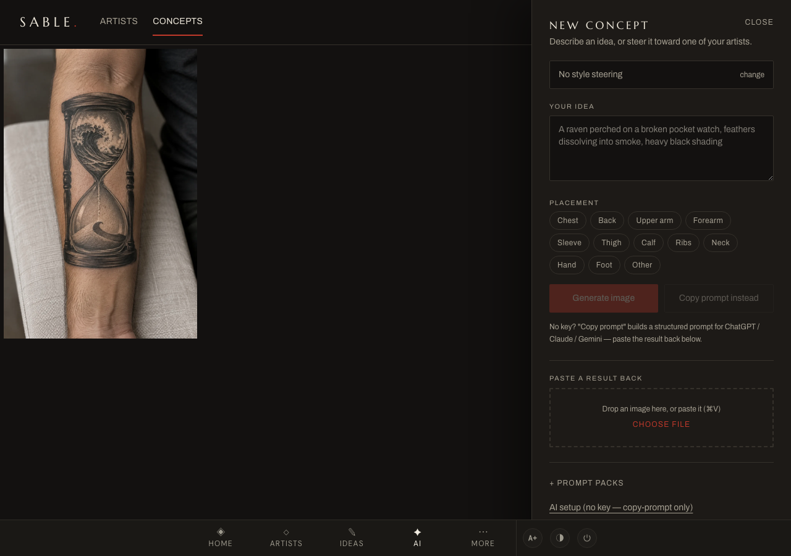
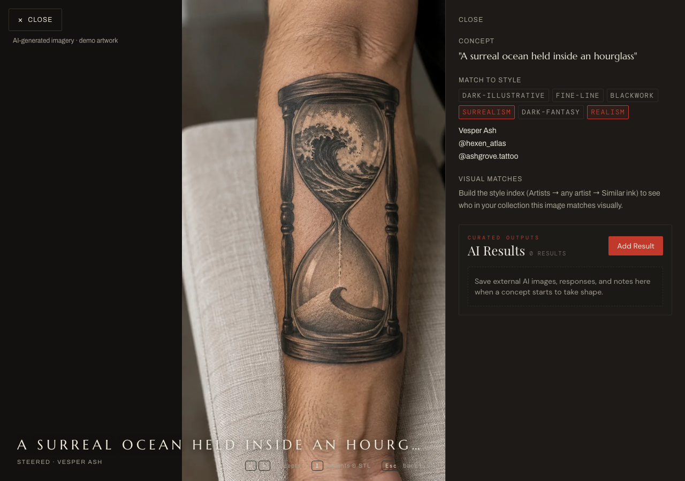

# AI concepts

*Generate tattoo concepts in your artists' styles, keep the results on their own wall, and export relief STLs.*

← [Back to contents](README.md)

---

**Concepts** is the second of Sable's two primary spaces — switch to it from the bar, or
arrive by pressing **`G`** while viewing an artist full-screen. Your saved concepts tile
the page just like the artists' Wall; the **composer** slides in from the right when
you're making something new.

If you reuse one of Sable's shipped demo images in a saved concept, its
**AI-generated imagery** label appears on the concept tile and remains visible in the
full-screen viewer.

## The composer

Tap **+ New concept** (or press `G` in the viewer — the composer opens with that artist
already set). One panel, top to bottom:

- **Steer card** — the artist whose style shapes the image. Tap **change** to pick a
  different one, or clear it for an unsteered concept.
- **Your idea** — describe it plainly, e.g. *"A raven perched on a broken pocket watch,
  feathers dissolving into smoke, heavy black shading."*
- **Placement** — forearm, upper arm, chest, back, calf…
- **Generate image** — creates the image in-app (needs an API key, below).
- **Copy prompt instead** — copies a richly-structured prompt for ChatGPT, Claude, Gemini
  or AI Studio. Run it there, then **drop or paste the result** into the composer's
  drop zone — it saves to the wall exactly like a generated image.

Your draft (steer, idea, placement) is kept on this device, so hopping out to another AI
tab and back never loses it. It clears when the concept saves.

### AI setup — keys and providers

Open **AI setup** in the composer to add an **OpenAI key** (DALL·E 3) or a **Gemini key**,
each stored only on your device. Both are **paid APIs that need billing enabled**
(≈$0.04/image); a Google AI Pro subscription does **not** cover Gemini *API* usage — to
stay free, use **Copy prompt** and paste the result back instead. With both keys set, a
provider toggle appears.

### Prompt packs

**+ Prompt packs** in the composer opens the multi-provider workbench: turn free text or
a Brief idea into tailored prompts for ChatGPT (generation), Adobe Firefly (composition),
Gemini (critique & placement) and Claude (artist-facing language). **Save Pack** keeps the
whole set on a concept. Pack concepts without an image yet wait in a **Drafts — awaiting
an image** strip under the wall until you paste a result in.

## Work with a concept

**Click a concept on the wall** and it fills the screen — same viewer as the artists'
Wall, same keys (`←` `→`, `Esc`, or tap **× Close** top-left; the controls fade when your mouse is still).
On a phone, swipe left / right between concepts, swipe down to close, and tap the image (or
**Details**) to show **Delete** and **Variants & STL export**. Press **`I`**
(or the on-screen button) for everything attached to it:

- **Prompt & response** — the original prompt, any saved pack (switch providers and copy
  again), and any AI text that came back.
- **Match to style** — tag the concept with styles and its **top artist matches** appear;
  tap one to open their Instagram.
- **Visual matches** — once the style index is built (Artists → any artist →
  [Similar ink](03-gallery-and-ranking.md#similar-ink)), the concept **image itself** is
  compared against every artist's work on-device, ranking who in your collection could
  actually execute the piece — no tags involved. A **taste fit** percentage also shows
  how strongly the image matches your collection's overall taste (learned from your
  ranking and shortlist statuses).
- **AI results** — keep multiple outputs as curated variants, each with an image, text,
  notes and a rating. Mark one **Best** to keep the strongest direction first.
- **Delete** removes the concept — an **Undo** bar appears for a few seconds if you change
  your mind.

## Try a concept on skin

On any result with an image, choose **Try on skin**.

**Live camera** (free, instant, works offline) opens your camera with the design floating on
the live view — the white of the design disappears so only the ink shows. Drag to move it,
pinch to size and turn it (or use the **Size**, **Rotation** and **Ink** sliders). Tap
**Real size**, hold a bank card flat against your skin and match the dashed outline to it,
and the design's width shows in centimetres. **Save snapshot** keeps the view as a variant.
No camera, or access blocked? **Use a photo** puts the design over a still photo instead.

For a polished render, use the AI preview below it: pick a photo of where the tattoo would
go (take one with the camera or choose from your library), set the **Placement**, and tap
**Generate preview**: Gemini draws the design onto your skin as a healed tattoo, following
the curve of the body and the photo's lighting. Tap **Save as variant** to keep it on the
concept next to your other results, or **Change photo…** to try another angle.

This needs a Gemini key (set it in AI setup on this page). Your photo and the design are sent
to Google's Gemini image model — about $0.04 per image — and nothing is kept unless you save
the result.

## Export a relief STL

When a result has an image, choose **Make STL**. You can also start from a reference image
in an idea (its **3D print** button), or pick any photo on your device with **Use another
image…** inside the drawer. (Images pasted as a link from another website may be blocked
by the browser; upload them instead.)

Pick a **Style**:

- **Relief** — brightness becomes height, so shading turns into a sculpted surface.
- **Line art** — every point is either the flat plate or full height, so line work prints as
  crisp raised lines. It starts with **Raise dark lines** ticked (untick it to engrave the
  lines into the plate instead), **Fine** detail and a low `1.5mm` line height, which print
  far more reliably than tall thin fins. Move the **Line threshold** to catch fainter lines
  or keep only the boldest, and switch to **Line mask** to see exactly what will be raised
  (dark) against the plate (light), one square per sample, so broken or missing lines show.
- **Lithophane** — a thin plate that shows the image when held up to a light: dark areas
  are printed thick (up to `3mm`), highlights thin (down to `0.8mm`). Print it standing
  upright in white or natural filament at 100% infill. Invert and threshold don't apply.

Tick **Add a border** for a 3mm full-height frame round the edge — it stiffens a thin
lithophane and neatens any plaque. There's no hanging hole yet; add one in your slicer
(or drill it) if you want to hang the print. Transparent PNGs work: the background counts as white.

Defaults: width `80mm`, max relief `3mm`, base `1.2mm`, detail `medium`, smoothing
`light`. **Fine** detail samples about every 0.3mm at 80mm wide — close to a 0.4mm
nozzle — for fine-line work, at the cost of a larger file.

Switch to **3D preview** to see exactly what will print and drag to rotate it; it updates
as you change settings. The download is a binary STL, which is much smaller than the old
text format and loads quickly in Cura or any other slicer.

> **Tip:** the concept tags use the same six styles as the rest of the app, so a well-tagged
> concept points straight at the artists already in your collection.

---

Next: **[Backup & restore →](07-backup-and-settings.md)**
