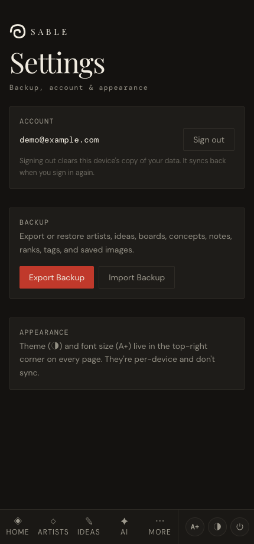

# Settings, backup & restore

*Your data syncs to your account across devices, with a local copy on each. Export a backup whenever you want an extra restore point you control.*

← [Back to contents](README.md)

---

Everything you create (artists, photos, ideas, boards, concepts, ranks, tags, notes) is
kept as a local copy in your browser **and** synced to your account, so it follows you
across devices and still works offline. The **Backup** panel in **More → Settings** lets
you export a full snapshot you control — and it's where your account and sign-out live.

## Export a backup

Tap **Export Backup**. A single JSON file downloads — named with the date, e.g.
`tattoo-backup-2026-05-30.json`. It contains everything:

- artists, their tags, status, studio, notes and ranks
- your saved images (embedded in the file)
- ideas, boards and AI concepts
- any convention attendance you've recorded

## Restore a backup

Tap **Import Backup** and choose a previously exported file. This **replaces** the current
data with the backup's contents — useful for recovering an earlier snapshot, or for pulling
your data into an account that doesn't have it yet.

## When to back up

- **Before clearing your browser data** or its site storage.
- **Before any big change** you might want to undo.
- **For an offline or portable copy** — switching devices normally just needs sign-in (your
  account syncs everything), but a backup is an export you hold yourself.
- Periodically, just in case — it's one tap.

> **Note:** because images are embedded, a backup with lots of uploaded photos can be a
> large file. That's expected — it means nothing is left behind.

---

← [Back to contents](README.md)
