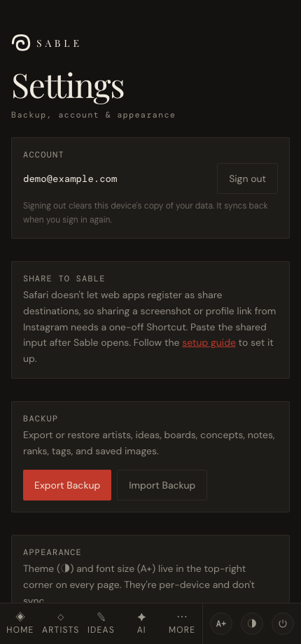

# Settings, backup & restore

*A device-local library stays on that device. Export a portable snapshot whenever you want a restore point you control.*

← [Back to contents](README.md)

---

With device-local storage, everything you create stays in this browser even if you
use a real login. Signing out clears displayed caches, not the owner-namespaced
library; signing back in as the same owner on the same device restores it. That is
**not** a cloud copy. Cloud-storage builds sync separately across devices. The
**Backup** panel in **⋯ → Settings** requests a full snapshot you control.

## Export a backup

Tap **Export Backup**. A JSON download is requested — named with the date, e.g.
`tattoo-backup-2026-05-30.json`. It contains the current document snapshot:

- artists, their tags, status, studio, notes and ranks
- canonical local saved images embedded as image bytes, including paid concept results
- ideas, boards and AI concepts
- any convention attendance you've recorded

Sable reports **“Download requested—check the file was saved”** only after it has
read every required local image and initiated the download. A browser click cannot
verify that a file actually landed or was copied off this device. If an image is
missing or unreadable, the export stops rather than offering a partial file.
External portfolio links and bundled artwork remain references in the JSON; Sable
does not fetch those third-party images. Historical unclassified artist-cache bytes
that are not part of the canonical library are not included. Keep any such photos
separately until recovered into the library.

On **Concepts**, the paid-image backup indicator says **“No export requested”** or
shows the last download request and **“Paid results saved since last export request.”**
Export again after saving paid results, then confirm and store the file safely.
Browser storage persistence is only an eviction hint, not an off-device backup.
The refinement drawer offers the same **Export full library backup** action, not a
concept-only file. Export after **Variation saved**, confirm the download, and keep a
copy away from this device. A pending job is not a saved result or part of this backup.

## Restore a backup

Tap **Import Backup** and choose a previously exported file. This **replaces** the current
data with the backup's contents — useful for recovering an earlier snapshot, or for pulling
your data into an account that doesn't have it yet.

## When to back up

- **Before clearing your browser data** or its site storage.
- **Before any big change** you might want to undo.
- **Before switching devices** with device-local storage; import the file on the other
  device. Cloud-storage builds can sync separately, but this is a copy you hold yourself.
- Periodically, just in case — it's one tap.

> **Check the downloaded file:** Sable can request a download, not confirm that your
> browser saved it. Store a copy away from this device if you need protection against
> device loss.

---

← [Back to contents](README.md)
