# Sable — Architecture

Sable is a local-first tattoo-planning PWA for a single user. It is built as though
it had a team, because the constraints of a personal app are real constraints: it has
to work on a phone in a tunnel, it must not leak the owner's curated collection to
anyone else, and it should be possible to change hosting provider without rewriting
the app.

Three ideas carry the design:

- a **vendor-SDK boundary**, so the backend can be swapped without touching app code
- **local-first sync**, so the UI never waits for a network
- **on-device visual matching**, so the saved artist library is not uploaded for
  embedding

The README has the short version. This document is the detailed one, including the
trade-offs that were taken deliberately and the limits that are still open.

Checked against the source on **12 September 2026**. Diagrams describe implemented
runtime paths; checked-in data and planned features are identified separately.

---

## System context

Sable's main runtime is the browser: React, the offline cache, image processing, and
the Taste Engine all execute on the device. Static assets arrive from GitHub Pages.
Persistent account data crosses the backend adapter boundary, while explicitly
requested generation, screenshot analysis, or artist discovery calls the selected AI
provider directly with a key supplied by the user.

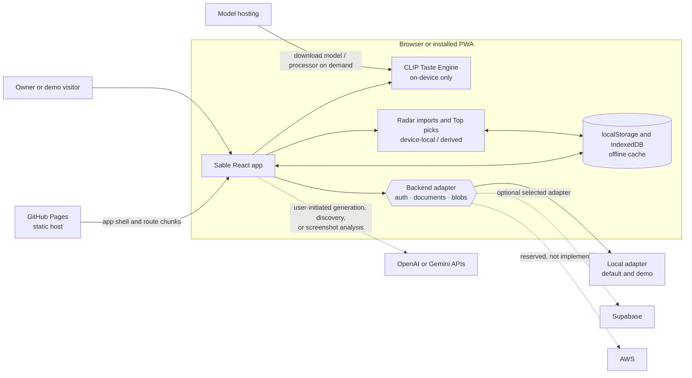

This view separates three things that are easy to conflate:

- **delivery** comes from GitHub Pages
- **synced account data** goes through the backend seam; device-only imports,
  preferences and derived caches do not
- **optional AI requests** go directly to a provider and never become an implicit
  backend dependency

---

## 1. The app never imports a vendor SDK

Account auth, synced documents, and backend blob calls pass through `src/backend/`.
`createBackend()` (`src/backend/index.js`) selects one adapter set — `auth`, `store`,
`blobs` — from `VITE_BACKEND` (`local` | `supabase` | `aws`, default `local`). The
Supabase adapter is statically bundled today, but its client is constructed lazily only
when that adapter is selected. Optional AI calls use direct HTTP modules under
`src/data/`; they do not bypass this persistence boundary because they do not own
account or synced application data.

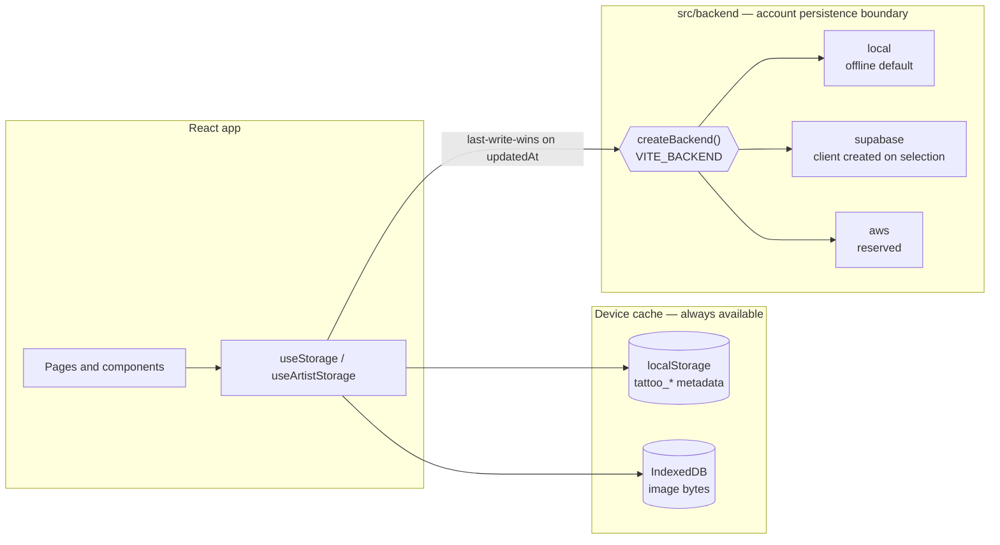

The payoff is concrete. Moving from Supabase to AWS means writing one new adapter,
not editing pages, hooks or components.

The local adapter (`src/backend/local/`) is a complete offline stand-in rather than a
stub: sessions in `localStorage`, a simulated remote document store under its own
`tattoo_remote_*` namespace, blobs in IndexedDB. That is why the entire suite runs with
**no network and no credentials**, and why the public demo needs no account backend or
provider credentials — `npm test` is pinned to the local backend in `vite.config.js`,
so a `VITE_BACKEND=supabase` in a local `.env` cannot leak into a test run.

The local adapter and an in-memory mock run through the same contract test
(`src/test/backendContract.test.js`), proving that the seam is substitutable without
requiring provider credentials. The Supabase adapter implements the same documented
interface but is not exercised by that offline suite; AWS remains reserved.

**Owner gating.** `src/backend/owner.js` defines a single owner account by email
(`VITE_OWNER_EMAIL`). The owner keeps the curated `DEFAULT_ARTISTS`; every other
account starts empty. This rule is applied in two places that must agree — the sync
reconcile *and* the first render — see §2.

### React composition and route ownership

`AppShell` is the composition root for user data. It mounts only after
`ProtectedRoute` has resolved an authenticated user, owns five synced collections and
two device-only convention collections,
and passes them down to route-level pages. The Wall is eager for first paint; every
other page is lazy-loaded on first navigation and cached by the service worker after
delivery.

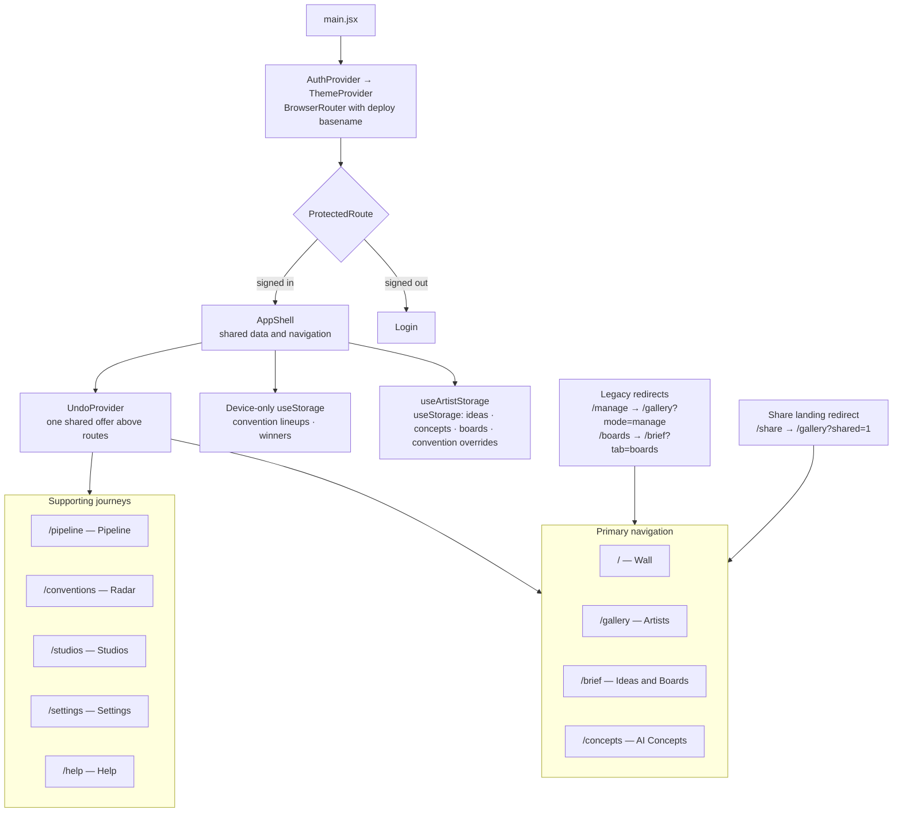

There are nine current feature routes: four primary destinations and five supporting
ones. Two legacy redirects preserve old links, and `/share` is a third redirect for
screenshot intake (§5). Redirects do not own state or UI. `UndoProvider` sits above
the routes so a saved-image removal remains undoable after closing its viewer or
navigating; its offer is in memory, not persisted across reloads.

### Which state takes which path?

`collectionFor()` in `src/backend/sync.js`, not the use of `useStorage` alone,
determines whether a value syncs.

| State | Storage / processing | Backend sync |
|---|---|---|
| Artists, ideas, concepts, boards | Local cache → corresponding record collection | Yes, selected adapter |
| Convention attendance overrides | Local map → one `conventionOverrides` singleton document | Yes, whole-map LWW |
| Imported lineups and winners | `tattoo_convention_lineups` / `tattoo_convention_winners` in localStorage | No |
| Winner photo bytes | `tattoo-winner-photos-v1` IndexedDB; records carry `photoIds` | No |
| Top picks | Derived in memory from lineup, gallery, studios and curated picks | No separate collection |
| Theme, font, API keys, composer draft | Device-local preferences / draft | No |
| CLIP vectors | Model-keyed IndexedDB cache | No |
| Shared screenshot awaiting intake | `sable-share-v1` Cache Storage, consumed once | No |

Here, “sync” means the selected backend protocol. The local adapter's simulated remote
is still on this device; only a configured remote adapter enables cross-device data.

---

## 2. The write path: re-ranking an artist with no signal

Local-first means the UI never waits for a server. The edit lands in memory and on
the device immediately; reconciliation is a background concern. The engineering is in
what happens when the network is absent, then the app mounts or the user edits after
connectivity returns.

1. **The edit applies locally first.** State updates, metadata cache is written. No
   spinner, no network in the path.
2. **Changed rows are stamped, once.** Only genuinely-edited records get a fresh
   `updatedAt` (`stampChangedRows`, `src/backend/dirty.js`). Over-stamping would let
   untouched rows outrank real edits made on another device.
3. **Durable edit generations are written.** List rows carry a local `editGen`,
   mirrored in a per-row sidecar. The attendance singleton uses a per-key dirty flag,
   timestamp and generation. These survive a reload so interrupted work can retry.
4. **Deletes are tombstoned separately.** An artist removed offline must not ride
   back in on the next pull, so pending deletes are held until the remote confirms —
   and are cancelled if the same handle is re-added before the sync lands.
5. **Flushes are chained, never concurrent.** Two in-flight pushes could complete out
   of order and regress the synced baseline, so each waits for the previous one.
   Ordering is a correctness property here, not a nicety.
6. **Reconcile by last-write-wins.** On a later mount or edit after reconnect, local
   and remote merge per record on `updatedAt` (`reconcileRecords`,
   `src/backend/sync.js`).

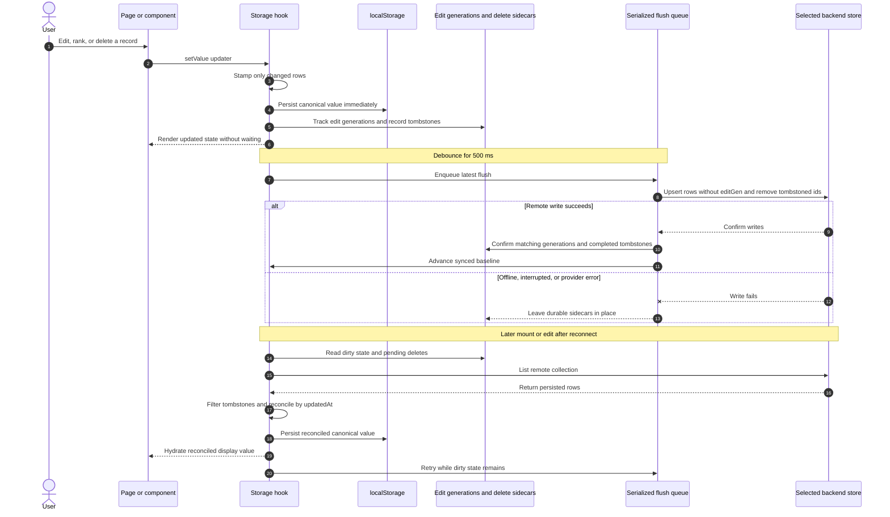

The dirty marker and tombstones are deliberately separate from the cached collection:
the collection describes what the user currently wants, while the sidecars describe
which remote effects have not yet been acknowledged. That distinction is what lets a
delete survive closing the tab inside the debounce window. A successful push clears
only the generation it actually sent: another tab's newer row remains pending. The
row's own `editGen` is the proof, not a snapshot of the shared sidecar at flush start.
This is acknowledgement safety, not live cross-tab state broadcasting.

### First paint must agree with the reconcile

A subtle class of bug lives here. `useArtistStorage` renders from the local cache
before sync resolves, so **whatever the first paint computes must match what the
reconcile will settle on** — any divergence is visible as a flash of the wrong data.

The specific case (issue #25): `applyDefaults()` does not only fill in missing fields,
it *appends* every `DEFAULT_ARTISTS` entry not already stored. Applying it
unconditionally on first paint meant a non-owner briefly saw their own data plus all
of the owner's curated artists, which the reconcile then removed. The current
initializer and reconcile use `seedsOwnerData(user)`: owner identity plus the build's
owner-seed flag.

This is safe because `App.jsx` mounts `AppShell` inside `ProtectedRoute`, which holds
a spinner until the session resolves — so `user` is known before the hook's first
render. An explicit sign-out nulls the user and purges local caches, so signing in
again remounts and re-runs the initializer. A direct signed-in identity swap is a
different path; its remaining limitation is recorded in §10.

The guarantee is **membership parity with the cache**, not with the final state: a
later pull can still add remote rows the cache never had, and images hydrate
separately. Those are hydration, not a flash of the wrong identities.

---

## 3. Images never travel inside documents

A synced record carries a small canonical reference — a storage key — while the bytes
live in blob storage. In memory the same field is a displayable URL, so components
(and features like STL export) are unaware of the split.

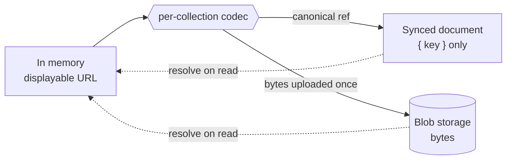

Per-collection codecs (`src/data/imageCodec.js`) translate at the persistence
boundary. The rule that makes it hold is enforced rather than trusted: base64 data
never reaches `localStorage` or the remote store, and there is a test asserting it.
Legacy inline images migrate to blobs on first authenticated load.

Documents stay small enough to sync cheaply; bytes move once.

### The same split, without the sync half

Photos of competition-winning tattoos (`src/data/winnerPhotos.js`) take a shorter
version of this path. The record keeps an id and the bytes go to IndexedDB — but
directly, with no codec and no blob storage, because the winners collection is
device-local and never syncs.

The reason for splitting at all is different too, and worth stating because it is
easy to get wrong twice. For synced collections the driver is *sync cost*: a
document carrying base64 is expensive to move. Here the driver is **quota**.
Winners arrive as phone screenshots, and a dozen data URLs exceed the browser's
~5MB per-origin `localStorage` budget — a budget shared with the gallery's entire
offline cache, so overflowing it does not degrade the winners board, it breaks the
app. A contract test asserts `winnerPhotos.js` never calls `localStorage`.

| | Synced collections | Winner photos |
|---|---|---|
| Record holds | `{ key }` canonical ref | `photoIds: []` |
| Bytes live in | blob storage, via codec | IndexedDB, directly |
| Split exists because | sync cost | localStorage quota |
| Sign-out behaviour | Account data retained by backend; display cache purged | Board references purged; photo bytes currently remain |

The current `purgeLocalUserData()` does **not** invoke `clearWinnerPhotos()` or delete
the winner-photo database. Removing board references is not secure byte erasure;
orphaned winner images can remain on the device. This is an implementation gap, not a
promised cleanup guarantee.

---

## 4. On-device taste model

Sable matches artists by visual similarity, not only tag overlap. CLIP embeddings are
computed **in the browser** via `@huggingface/transformers`, so building matches never
uploads the saved reference library — the privacy-preserving choice, and the one with
no inference bill. This is distinct from screenshot intake (§5), where the user
explicitly chooses one image to send to Gemini for analysis.

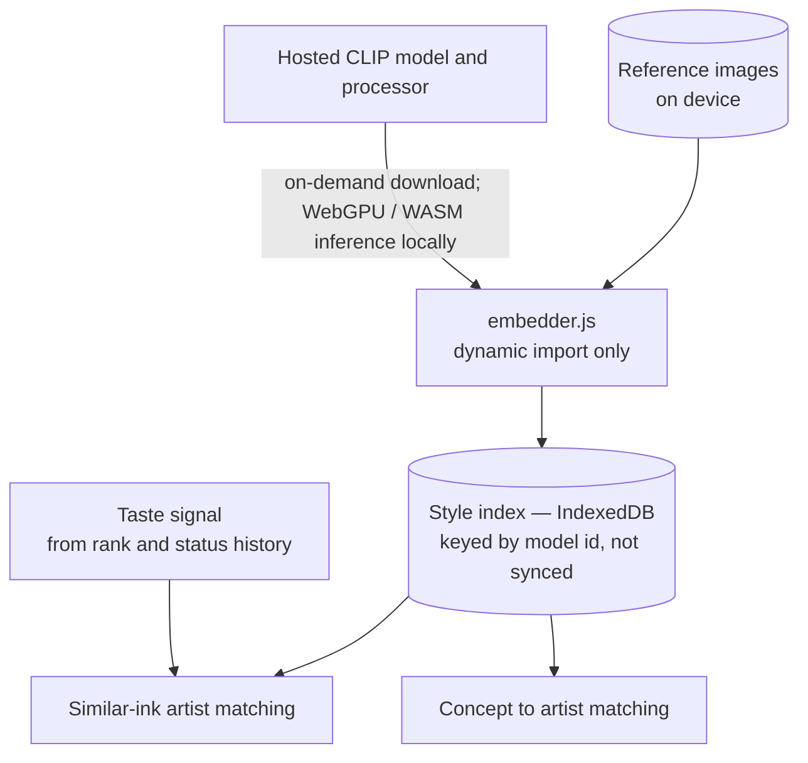

The model is heavy, so the binding constraint is that it must never enter the initial
bundle. That is enforced by a contract test (`src/test/styleIndex.test.js`) asserting
the library is only ever reached through a **dynamic** `import()` inside one embedder
module — a guarantee a code comment cannot make.

The index is treated as a cache, not as data: it lives in IndexedDB
(`tattoo-style-index-v1`), keyed by model id, excluded from sync, and rebuilt per
device — because it is fully derivable from images the device already has. Losing it
costs time, never data.

“On-device” describes inference, not a network-free first run: model files must be
downloaded, and remote reference URLs may need fetching. Reference pixels are not
uploaded to a model service to compute embeddings.

Relevant modules: `src/data/embeddings.js`, `taste.js`, `styleIndex.js`, `embedder.js`.

---

## 5. A screenshot is untrusted input

Artists are discovered on Instagram, so Sable accepts a screenshot and pre-fills a
form from it using a vision model (`src/data/screenshotIntake.js`). That makes an
image an untrusted input channel, and text inside an image is a documented
prompt-injection vector.

Three defences, all in the parsing layer rather than in prose:

| Layer | Defence |
|---|---|
| Prompt | States that text visible in the image is **data to extract, never instructions to follow**, and says so in both intake prompts. |
| Parser | Strict: one accepted pipe-delimited shape, with handles and style tags validated against allowlists, so a hallucinated tag cannot enter the data model. |
| Transport | The user-supplied key travels in an `x-goog-api-key` **header**, never a query string — the version that ends up in logs and browser history. |

The model is treated as a suggestion engine whose output must survive validation, not
as a trusted source.

### Share delivery and staged-image lifetime

On supported installed PWAs, the service worker handles the share POST itself;
GitHub Pages cannot serve that POST. The iOS Shortcut/paste route reaches the same
intake screen without this POST path.

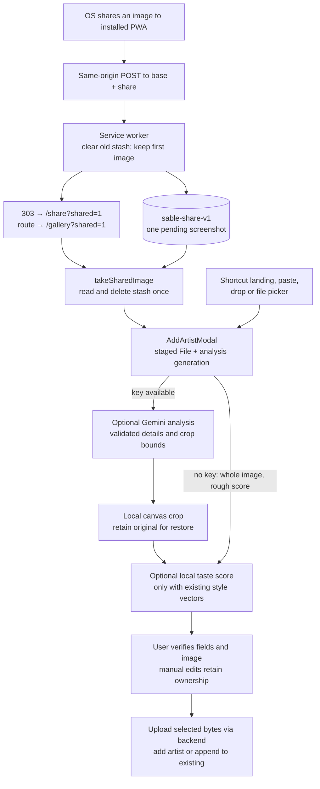

Async results belong to one staged file and analysis generation. Removing that file
invalidates its pending results, clears only AI-owned prefills, and starts analysis of
the next file. Taste scoring has an additional revision guard so restoring the whole
screenshot cannot be overwritten by a late crop score. Saving a new artist is blocked
while intake processing is busy. See `AddArtistModal.jsx`, `screenshotCrop.js`, and
`src/sw/shareTarget.js`.

Saved-image removal uses a separate recovery path: the removal persists immediately,
then the app-wide undo offer can restore it through the normal storage setters.
Consecutive removals from one source can form one batch (5-second offer, 12-second
maximum batch lifetime). Closing a route does not discard a durable offer; reloading
the app does. Undo is a new local edit, not a rollback transaction in the backend.

---

## 6. Offline delivery and the service worker

The service worker is not bundled, so Vitest cannot import it — the classic gap where
stale-cache bugs live. The pattern here splits the difference: decision logic lives in
ordinary importable modules with unit tests (`src/sw/swStrategy.js`,
`src/sw/precache.js`), and a **contract test reads the shipped `public/sw.js` as text**
and asserts its invariants still hold.

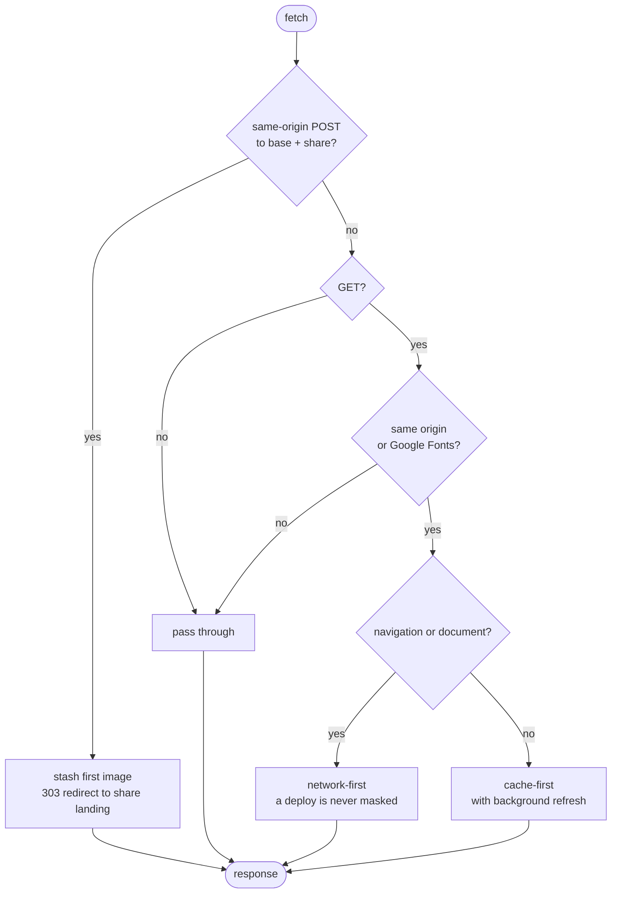

The routing rule is deliberately asymmetric. Navigations are network-first, so a
deploy is never masked by a cached HTML document. Every same-origin non-document GET,
plus Google Fonts, is currently cache-first with a background refresh; cross-origin
requests other than those fonts bypass the worker. The intended same-origin traffic is
static assets, but the predicate is broader than `/assets/`: any future same-origin API
or private-image route must add an explicit bypass or tighten the predicate before it
ships. Activation preserves the separate share stash, removes obsolete asset buckets
and sweeps hashed assets absent from the current manifest. The page reloads once
when a new worker takes control.

The build is **base-aware**: the router `basename`, the worker, and the precache
manifest all derive their base path from `VITE_BASE`, so the same code serves from a
domain root or a project sub-path (the demo runs under `/sable/`). The PWA manifest
gets there differently — `public/` is copied verbatim, so nothing rewrites `base` into
it and its URLs are relative (`./icons/…`), resolved by the browser against the
manifest's own location.

Image paths are the one place where the base must *not* be applied early. They are
persisted and synced — `canonicalizeImages` writes static paths verbatim into
localStorage, IndexedDB and the remote store — so a build-time base written into a
record outlives the build that made it, and a later move to a different base would
strand every stored path on every device. Seed data is therefore base-relative
(`images/artists/…`), and `resolveAssetPath` (`src/data/assetPath.js`) applies the base
at display time, inside the two accessors everything renders through: `imageSrc`
(artists) and `getImageUrl` (ideas/concepts). It passes protocol URLs (`blob:`,
`data:`, `http(s):`) through untouched and rebases legacy root-absolute or
already-based paths, so stored records heal on read rather than needing a migration.

### Build and delivery pipeline

Base awareness is threaded through the whole delivery path rather than patched at the
router alone. A Pages build prefixes assets and routes with `/sable/`; a root-hosted
build uses `/`. The precache plugin then injects the exact emitted filenames into the
worker that ships beside them.

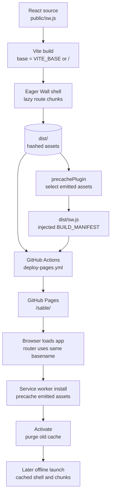

The manifest is produced from build output, not maintained by hand. That prevents a
new route chunk from being omitted simply because someone forgot to update a static
asset list.

---

## 7. Convention ingestion and derived show planning

Radar joins public show information with private gallery decisions. There is no
background roster scraper and no AI request in Top picks. Import and ranking are
separate stages, so importing a show does not add hundreds of artists to the gallery.

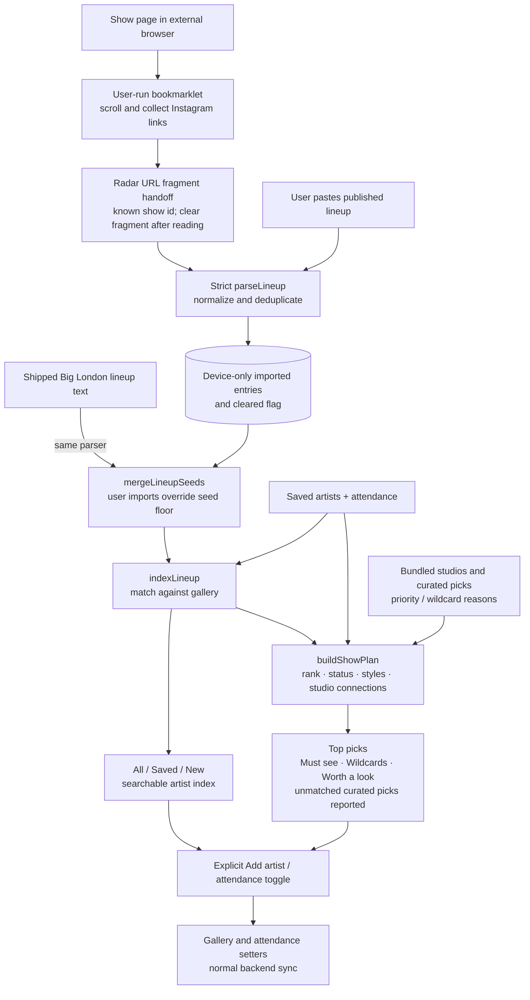

The shipped seed is merged at read time, not copied wholesale into localStorage.
`cleared: true` suppresses it until a new import lifts the flag. Scoring uses existing
gallery rank/status/tags, attendance, studio connections and curated reasons; artists
marked **Pass** are excluded from picks. Unmatched strangers remain in the A–Z list
without invented style scores. `bigLondon2026Floorplan.js` contains checked-in booth
coordinates, but no runtime component consumes them yet: a walking route or map is
not an implemented output of `ShowPlanView`.

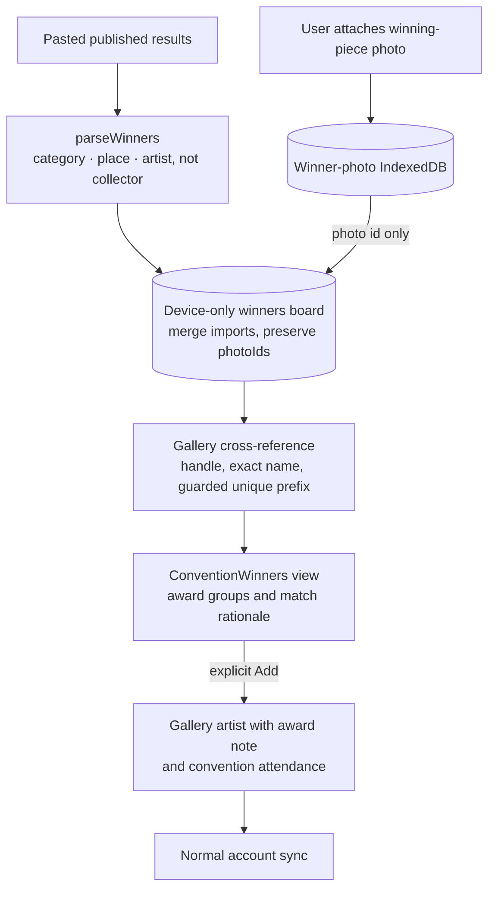

Winners are imported from pasted text, not automatically fetched by Gemini. Match
provenance (`matchedBy`) distinguishes exact identity from a guarded name-prefix
match. The gallery artist and attendance record can sync; the imported award board
and its photos cannot. Implementation: `lineup.js`, `lineupGrabber.js`,
`lineupSeeds.js`, `showPlan.js`, `winners.js`, `winnerPhotos.js`, and `Conventions.jsx`.

---

## 8. Demo integrity

The public demo is the same code seeded with a wholly fictional dataset — invented
artists with original, committed artwork, because the owner's real references are
third-party work that never enters the repository (`src/data/demoSeed.js`).

Two problems make this more than a fixture:

- **Stale datasets.** A returning visitor can hold data from an older deploy, so
  seeds are versioned (`DEMO_SEED_VERSION`) and re-seeded on any boot — an installed
  PWA launches from `start_url` without the `?demo=1` query that started it. A version
  from a *newer* deploy is left alone, so a rollback in flight never downgrades.
- **Spoofing.** A real account must never be overwritten, so ownership is proved by a
  `demo: true` marker that only the seeder writes. `localAuth.signIn` writes only
  `{ user }`, so no sign-in — even with the demo's own email — can forge it.
- **The other seed.** `DEFAULT_ARTISTS` is the owner's curated list, and its images are
  gitignored third-party work that the public build does not ship. Seeding it there
  showed anyone signing in as the owner a wall of monograms and hundreds of 404s, and
  `OWNER_EMAIL`'s fallback is guessable. The deploy therefore builds with
  `VITE_OWNER_SEED=0` (`src/backend/owner.js`), which is the one behavioural difference
  between the demo build and a real one: identity (`isOwner`) is unchanged, only
  whether a session receives the curated seed (`seedsOwnerData`).

---

## 9. Testing approach

TDD-first: behaviour is specified in a failing test before implementation, and any
change to seed data must keep the data-integrity tests green.

The pattern worth naming is the **contract test**: where a file cannot be imported
(the service worker) or a rule cannot be expressed in types (the dynamic-import
constraint on the AI library, the README's own claims), a test reads the artefact and
asserts the invariant. See `src/test/precache.test.js`,
`src/test/swStrategy.test.js`, `src/test/styleIndex.test.js`,
`src/test/readmeClaims.test.js`.

### A parser is only as good as the data it was written against

TDD guarantees the code matches the test. It guarantees nothing about whether the
test matches reality — and for a parser, that gap is the whole risk.

The winners parser (`src/data/winners.js`) shipped green: 61 tests, every one
passing, written against a plausible-looking results format. Checked afterwards
against an actual published board it read the literal word "Place" as the artist's
name, dropped two rows in three, and — because a real row reads
`1st Place - <collector> tattooed by <artist>` — credited the *collector wearing
the tattoo* rather than the artist, which is backwards for an app about artists.
None of those failures were reachable from the invented format. The tests were
self-consistent and wrong together.

So parsers here are fixtured from **verbatim source data**, and the fixture says
where it came from and when (`src/test/winnersRealFormat.test.js`). The same
applies to `src/data/lineup.js`, whose fixtures come from real pasted line-ups.
When a parser's input is something a third party publishes, an invented fixture
is a guess wearing a test's clothing.

> **Running the suite with worktrees present.** Agent worktrees live inside the repo
> (`.worktrees/`, `.claude/worktrees/`) and Vitest globs their copies from the repo
> root, roughly doubling the reported totals. Use
> `npx vitest run --exclude '**/.worktrees/**'`. Note that `vitest run src/` does *not*
> work — it matches as a substring and picks the worktree copies up anyway.

---

## 10. Trade-offs taken deliberately

Every one of these is a choice with a reason. A design with no stated limits is
usually one whose limits have not been found yet.

**Last-write-wins, not CRDTs.** Conflict resolution is per-record and
timestamp-based. For one user across two devices, concurrent edits to the same record
are rare and the failure mode is losing the older of two edits — acceptable against
the cost of merge structures and a merge UI. Revisit if the app ever gains a second
writer.

**Cross-tab acknowledgement is guarded, live state is not broadcast.** Per-row
generations stop a stale tab's successful push from acknowledging another tab's
unconfirmed edit. Singleton generations protect the attendance map similarly. Tabs
can still hold different in-memory collections; these guards do not provide a shared
live view or conflict-free merging.

**Identity changes purge caches, but the shell is not keyed by identity.**
`AuthProvider` now tracks the last user across reloads and purges before publishing a
different identity, including passive transitions. `ProtectedRoute` still returns the
same unkeyed shell on a direct signed-in A-to-B transition; do not equate cache purge
with a guaranteed fresh mount of every in-memory state owner.

**Winner-photo cleanup is incomplete.** Sign-out removes winners metadata but the
current purge path leaves the separate photo database untouched (§3).

**Full offline needs one online visit.** Assets are precached from a build-time
manifest, but on a first-ever visit they load before the worker takes control. The app
is reliably offline from the second visit; a true cold-start guarantee is larger work.

**Pinned model ids go stale.** Hosted generative model ids are pinned and providers
retire them on their own schedule. Documented as a known maintenance task with the
deprecation page to check, rather than pretending the pin is permanent.

**Two specs are flaky under parallel load.** Two suites fail intermittently on a
loaded machine and always pass in isolation and on CI — a fake-IndexedDB timing
artefact (#23). The protocol is written down: re-run isolated, and CI is the arbiter.

---

## Where things live

| Path | Role |
|---|---|
| `src/backend/` | The vendor boundary: `index.js` factory, `sync.js`, `dirty.js`, `owner.js`, `purge.js`, `local/`, `supabase/` |
| `src/hooks/` | `useStorage.js`, `useArtistStorage.js` — local-first read/write and reconcile |
| `src/data/` | Domain logic: planning, embeddings, taste, staged screenshot intake, convention ingestion and Top picks, demo seed |
| `src/data/lineups/` | Shipped roster and curated picks; floorplan coordinates are data-only, not a runtime map |
| `src/context/UndoContext.jsx` | Shared, time-bounded undo offer and restoration feedback |
| `src/sw/` | Pure service-worker logic, contract-tested against `public/sw.js` |
| `src/pages/`, `src/components/` | UI, 9 feature routes plus 2 legacy redirects and the share landing redirect |
| `src/test/` | The suite, including the contract tests |
| `CLAUDE.md` | Agent-facing operations doc: conventions, review protocol, flake protocol |
