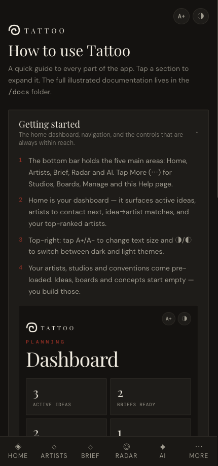

# Tattoo — User Guide

**Tattoo** is a personal, visual-first app for planning a tattoo journey: collecting
favourite artists, capturing ideas, matching the two together, and keeping an eye on
conventions and studios. It runs in your browser and installs to your phone's home
screen like a native app. All your data lives on your device — nothing is sent to a server.

---

## How the app is organised

A bar at the bottom of the screen holds the five main areas. Tap **More (⋯)** for the rest.

| Bottom bar | | More menu |
|---|---|---|
| **Home** — dashboard & overview | | **Studios** — where your artists work |
| **Artists** — your collection & ranking | | **Boards** — group ideas into mood boards |
| **Brief** — your tattoo ideas | | **Manage** — add artists, settings, backup |
| **Radar** — upcoming conventions | | **Help** — a quick guide on your device |
| **AI** — concept generator | | |

Top-right of every screen: **A+ / A−** changes text size, and **◑ / ◐** switches between
dark and light themes.

The same guidance is built into the app under **More → Help**:

> **On a fresh install** your artists, studios and conventions are already loaded.
> Ideas, boards and AI concepts start empty — those are the things you create.

---

## The workflows

1. **[Getting started](01-getting-started.md)** — first run, navigation, the dashboard.
2. **[Managing artists](02-managing-artists.md)** — add artists, photos, tags, status, notes.
3. **[Gallery & ranking](03-gallery-and-ranking.md)** — browse four ways, filter, and rank.
4. **[Brief & boards](04-brief-and-boards.md)** — capture ideas, link artists, build boards.
5. **[Conventions & studios](05-conventions-and-studios.md)** — shows near you, where artists work.
6. **[AI concepts](06-concepts.md)** — turn a description into a concept and match it to artists.
7. **[Backup & restore](07-backup-and-settings.md)** — keep your data safe and move it between devices.

---

## A typical planning journey

The pieces are designed to feed each other:

1. **Find** an artist on Instagram and **add** them in *Manage* (handle + name).
2. **Upload** a few of their pieces and **tag** them with styles (e.g. `blackwork`, `fine-line`).
3. **Rank** your collection in *Artists* — drag, nudge, or use swipe-compare.
4. **Capture an idea** in *Brief*, tag it with the same styles, and it instantly **suggests
   matching artists** to link.
5. **Group related ideas** into a *Board*, then **Copy brief** to share a clean summary with
   an artist.
6. Check **Radar** for conventions where your shortlisted artists are appearing, and
   **Studios** for where they work and how far that is.
7. **Export a backup** from *Manage* so none of it is ever lost.

---

## Installing on your iPhone

Tattoo is a Progressive Web App, so it installs without an app store:

1. Open the app's URL in **Safari**.
2. Tap the **Share** button, then **Add to Home Screen**.
3. Launch it from the new icon — it opens full-screen, in dark mode, like a native app.
