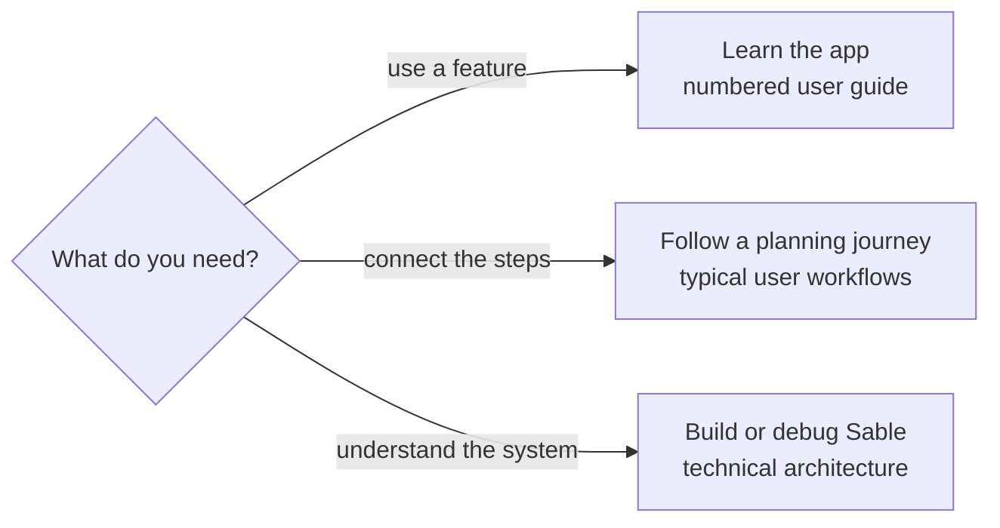
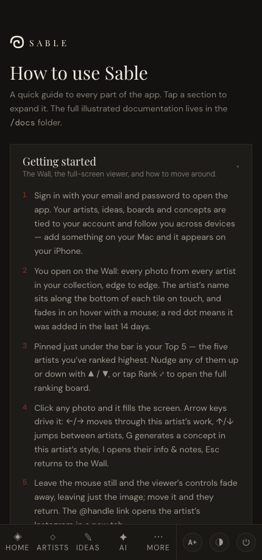

# Sable — User Guide

**Sable** puts every tattoo artist you love in one place — a gallery built for
browsing rather than a folder of screenshots. Each artist keeps their own work,
handle, styles and your notes together, and Sable learns your taste by *looking* at
that work: add an artist and it predicts roughly where they'd rank, open one and it
shows who else in your collection sits closest. From there it goes as deep as you
want — ranking, tattoo ideas linked to artists, concepts, conventions and studios.

It runs in your browser and installs to your phone's home screen like a native app.
Sign in with your account and your data syncs across devices, with a local copy kept
on each device so the app still works offline. The taste model runs on your device,
so your reference images never leave it.

---

## Start here

```mermaid
flowchart LR
  NEED{"What do you need?"}
  GUIDE["Learn the app<br/>numbered user guide"]
  JOURNEY["Follow a planning journey<br/>typical user workflows"]
  ENGINEERING["Build or debug Sable<br/>technical architecture"]

  NEED -- "use a feature" --> GUIDE
  NEED -- "connect the steps" --> JOURNEY
  NEED -- "understand the system" --> ENGINEERING
```

Use the numbered sections below to learn individual features, the
[typical user workflows](USER-WORKFLOWS.md) to follow end-to-end journeys, or the
[technical architecture](ARCHITECTURE.md) to build and debug the system.

---

## How the app is organised

Sable opens on **the Wall** — every photo from every artist you follow, edge to edge.
Click any photo and it fills the screen; from there the keyboard drives everything,
including generating a concept in that artist's style (`G`). The bar at the top switches
between the two primary spaces and holds the **⋯** Drawer for everything else.

| Primary (the bar) | | The Drawer (⋯) |
|---|---|---|
| **Artists** — the Wall & full-screen viewer | | **Classic gallery** — four browse views, ranking & Manage |
| **Concepts** — generated images on their own wall | | **Ideas** — tattoo ideas, with Boards as a tab |
| **+ Add artist** — one small form, done | | **Pipeline** — the shortlist dashboard |
| | | **Radar** · **Studios** · **Settings** · **Help** |

The same guidance is built into the app under **⋯ → Help**:

> **On a fresh install** your artists, studios and conventions are already loaded.
> Ideas, boards and AI concepts start empty — those are the things you create.

---

## The workflows

1. **[Getting started](01-getting-started.md)** — the Wall, the full-screen viewer, moving around.
2. **[Managing artists](02-managing-artists.md)** — add artists, photos, tags, status, notes.
3. **[Gallery & ranking](03-gallery-and-ranking.md)** — the classic browse views, filtering, and ranking.
4. **[Ideas & boards](04-brief-and-boards.md)** — capture ideas, link artists, build boards.
5. **[Conventions & studios](05-conventions-and-studios.md)** — shows near you, where artists work.
6. **[AI concepts](06-concepts.md)** — generate in an artist's style, prompt packs, variants, relief STLs.
7. **[Settings, backup & restore](07-backup-and-settings.md)** — account, backups, and moving data.

---

## Architecture and workflow maps

- **[Technical architecture](ARCHITECTURE.md)** — runtime boundaries, routes, local-first
  sync, image persistence, on-device AI, PWA delivery, and deliberate trade-offs.
- **[Typical user workflows](USER-WORKFLOWS.md)** — visual maps from artist discovery
  through briefs, concepts, contact planning, offline work, and recovery.

---

## A typical planning journey

The pieces are designed to feed each other:

1. **Find** an artist on Instagram and tap **+ Add artist** on the Wall — paste the handle
   or URL, tick their styles, drop in a few screenshots. Done in one form.
2. **Look.** Click a photo, arrow through their work, `↑`/`↓` to drift between artists.
   New photos you add wear a red dot for two weeks.
3. Found the style? Press **`G`** — the Concepts composer opens already steered to that
   artist. Describe the idea, pick a placement, generate (or copy the prompt into your AI
   of choice and paste the result back).
4. **Capture an idea** in *⋯ → Ideas*, tag it with styles, and it suggests matching artists
   to link. **Group related ideas** on the Boards tab; **Copy brief** shares a clean summary.
5. **Rank and shortlist** in *⋯ → Classic gallery*; *⋯ → Pipeline* shows where everyone
   stands: researching → shortlisted → contact next → contacted.
6. Check **⋯ → Radar** for conventions where your shortlisted artists are appearing, and
   **Studios** for where they work and how far that is.
7. **Export a backup** from *⋯ → Settings* so you always hold a restore point.

---

## Installing on your iPhone

Sable is a Progressive Web App, so it installs without an app store:

1. Open the app's URL in **Safari**.
2. Tap the **Share** button, then **Add to Home Screen**.
3. Launch it from the new icon — it opens full-screen, in dark mode, like a native app.
