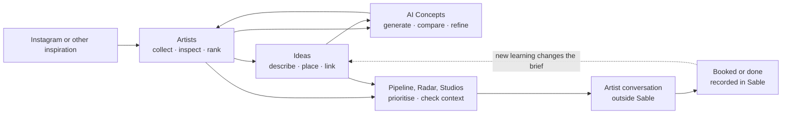
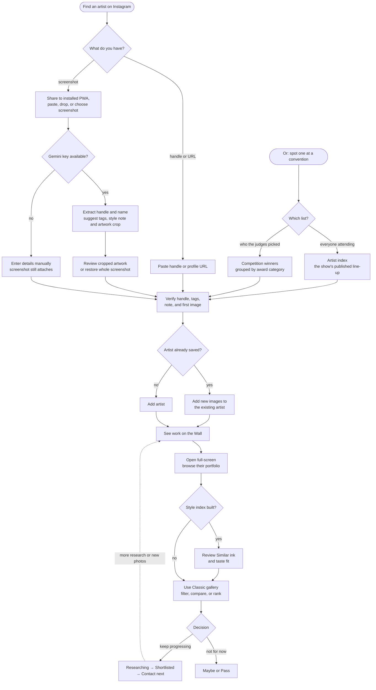
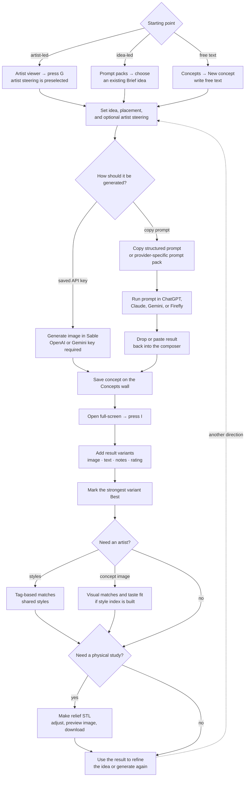
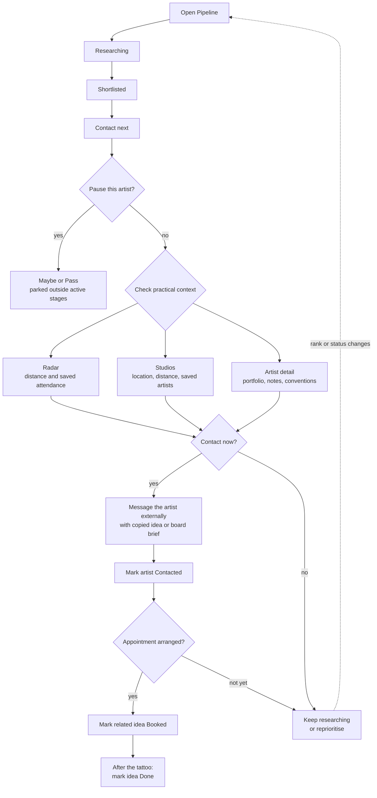
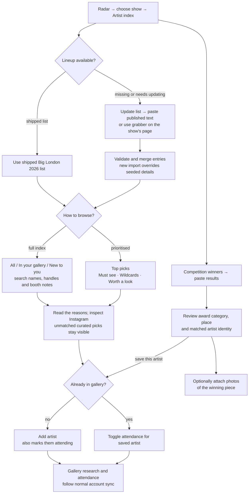
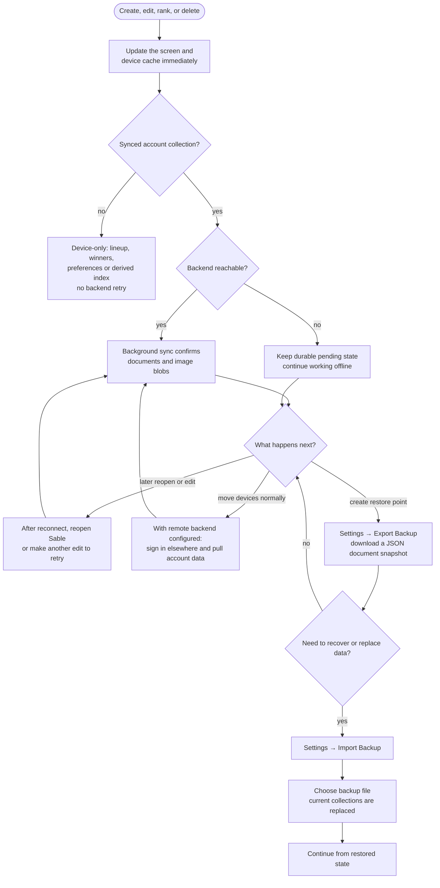

# Sable — Typical user workflows

Sable is not a set of isolated catalogues. Artists, ideas, concepts, rankings, studios,
and conventions are different views of one planning journey: notice a visual direction,
work out who can execute it, and turn that direction into something useful when speaking
to an artist.

These diagrams show the usual paths through the current app. Optional branches are
labelled; actions such as contacting an artist or booking an appointment happen outside
Sable, then their outcome is recorded in the app.

For implementation boundaries, persistence, and deployment, see
[Sable — Architecture](ARCHITECTURE.md).

## The planning loop

The loop is intentionally non-linear. You can begin with an artist whose work you love,
an idea you want to place, or a generated visual that helps identify the right artist.

---

## 1. Discover an artist and decide where they belong

The quickest path starts from an Instagram screenshot. A handle or profile URL works
too, and every AI-prefilled field remains a suggestion for the user to verify. A
convention is the other way in: its **artist index** and its **competition winners**
both land you on the same verify-and-add step.

Ranking and status answer different questions. Rank is one global preference order;
status says what should happen next. Moving someone to **Contact next** does not change
their rank, and moving them to **Maybe** does not delete their research.

Adding from either convention list does both halves of the job at once: the artist
lands in the gallery as *researching*, and is flagged as attending that show. Winners
arrive with the award already in their notes, so the reason you saved them survives.

OS sharing requires an installed PWA with share-target support and an active service
worker. The iOS Shortcut instead opens the same intake route ready for a paste.
If an artwork crop is unavailable or restored to the original screenshot, any taste
score is labelled rough. Removing a staged screenshot discards its AI suggestions
without erasing fields you edited yourself.

---

## 2. Turn an idea into an artist-ready brief

Ideas turn loose inspiration into structured, shareable context. The same six style tags
used by artists drive the first pass of matching.

**Copy brief** exports text; it does not send a message or expose a public link. Boards
group and order ideas without owning them, so deleting a board leaves its ideas intact.

---

## 3. Generate and refine an AI concept

Concept generation has two equally supported routes: direct paid API generation with a
key stored on the device, or a copy-and-paste round trip through an external AI tool.

Provider keys and the composer draft are stored only on the device, although a direct
request necessarily supplies its key to the selected provider. Visual artist matching
runs on-device. Generation, screenshot analysis, and **Ask Gemini** / suggestion
**Refresh** are the provider-bound paths; discovery sends aggregate style-tag counts, up
to eight saved style descriptors, and an exclusion list of known or dismissed handles,
but no saved images. The discovery and image-generation clients currently put the Gemini
key in the provider request URL; screenshot analysis sends it in a request header.

Relief export creates a printable heightmap-style STL. It is an optional downstream use
of an image result, not a new concept type.

---

## 4. Plan contact, travel, and appointments

Sable organises the decision and records its outcome; Instagram, email, convention
booking, and tattoo appointments remain external.

Convention attendance is currently curated by the user. Marking an artist as attending
surfaces that context on Radar, artist detail, Pipeline, and idea matching; Sable does
not automatically scrape an event roster.

---

## 5. Research a convention and choose who to see

Radar's imported roster and Top picks help decide who is worth researching. Attendance
flags are saved decisions, not tickets or confirmed appointments.

Top picks use your saved artists, rank/status, known studios and curated choices;
they do not run CLIP or infer styles for the whole roster. **Pass** artists are omitted
from picks, and wildcards are explicitly unjudged suggestions. This is a research
shortlist, not a mapped walking route.

Imports and winner photos stay on this device. Only artists you explicitly save and
attendance flags join synced collections. **Clear list** also suppresses the shipped
seed; a later import makes the list available again. Winner-name matches should be
checked, especially when the app reports a name-prefix match rather than a handle.

---

## 6. Work offline and recover safely

Every edit is local first. With a remote backend configured, sync is the normal
cross-device path for account collections; the default local/demo adapter stays on
one device. A downloaded backup is an extra document restore point.

API keys, theme, font size, and the derived Taste Engine index are device-local and are
not restored by account sync. Neither are the composer draft, imported lineups,
winners boards or winner photos. The index can be rebuilt from images; provider keys
must be entered separately on each device.

For supported saved-image removals, **Undo** remains available after closing a viewer
or moving to another route. Consecutive removals from the same source can be restored
as a batch. This is a short, in-memory recovery window, not a backup or an undo history
that survives reloads.

There is no `online` event listener today: connectivity returning by itself does not
start a retry. Reopening Sable runs reconciliation, while another edit schedules a new
flush.

Backup export serialises the values currently in memory. Inline `data:` images remain
embedded, but backend-resolved or signed image URLs are not fetched and materialised
into the JSON; those URLs may expire. Treat export as a document restore point, not a
guaranteed standalone archive of every image byte. Account sync remains the normal path
for moving backend image blobs between devices when a remote adapter is configured.
Settings backup covers the five account collections, not the device-only convention
imports or winner photos. Sign-out clears winner-board references but currently leaves
the photo bytes in IndexedDB; it is not a complete photo-erasure operation.
