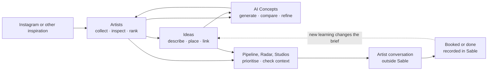
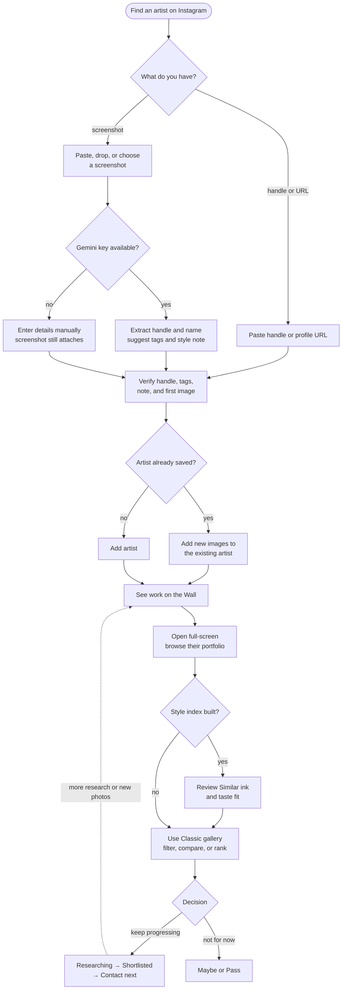
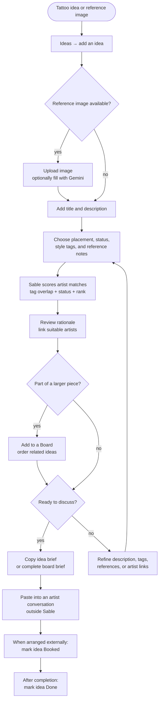
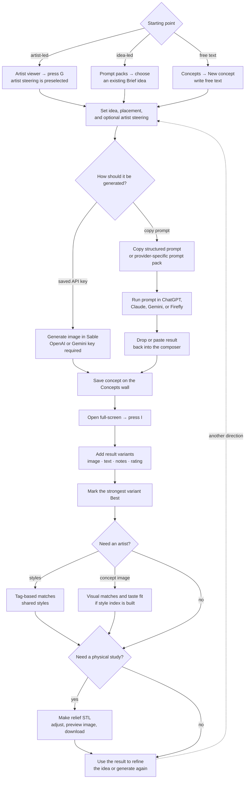
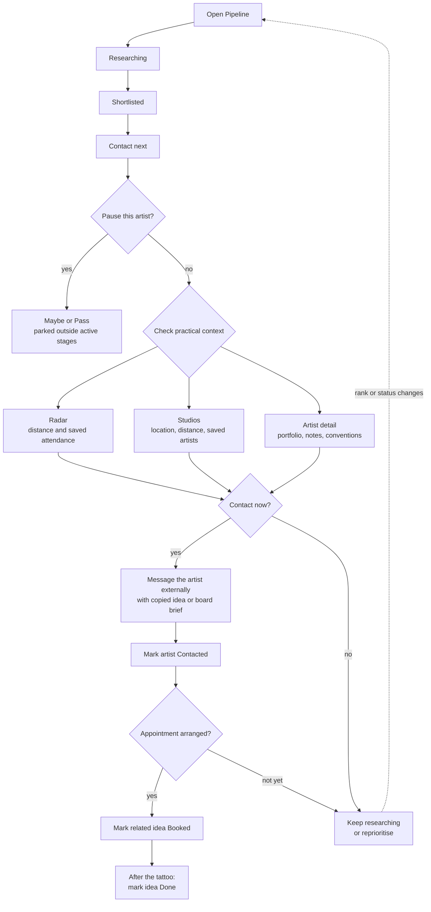
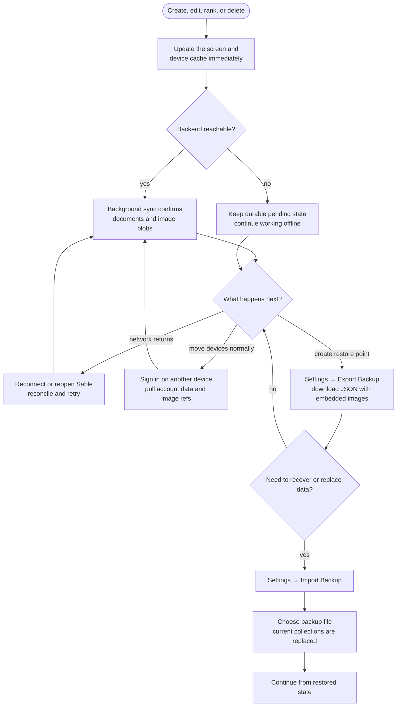

# Sable — Typical user workflows

Sable is not a set of isolated catalogues. Artists, ideas, concepts, rankings, studios,
and conventions are different views of one planning journey: notice a visual direction,
work out who can execute it, and turn that direction into something useful when speaking
to an artist.

These diagrams show the usual paths through the current app. Optional branches are
labelled; actions such as contacting an artist or booking an appointment happen outside
Sable, then their outcome is recorded in the app.

For implementation boundaries, persistence, and deployment, see
[Sable — Architecture](ARCHITECTURE.md).

## The planning loop

The loop is intentionally non-linear. You can begin with an artist whose work you love,
an idea you want to place, or a generated visual that helps identify the right artist.

---

## 1. Discover an artist and decide where they belong

The quickest path starts from an Instagram screenshot. A handle or profile URL works
too, and every AI-prefilled field remains a suggestion for the user to verify.

Ranking and status answer different questions. Rank is one global preference order;
status says what should happen next. Moving someone to **Contact next** does not change
their rank, and moving them to **Maybe** does not delete their research.

---

## 2. Turn an idea into an artist-ready brief

Ideas turn loose inspiration into structured, shareable context. The same six style tags
used by artists drive the first pass of matching.

**Copy brief** exports text; it does not send a message or expose a public link. Boards
group and order ideas without owning them, so deleting a board leaves its ideas intact.

---

## 3. Generate and refine an AI concept

Concept generation has two equally supported routes: direct paid API generation with a
device-local key, or a copy-and-paste round trip through an external AI tool.

The direct provider keys and composer draft remain on the device. Visual artist matching
also runs on-device; only an explicitly requested generation or screenshot-analysis call
goes to an external AI provider.

Relief export creates a printable heightmap-style STL. It is an optional downstream use
of an image result, not a new concept type.

---

## 4. Plan contact, travel, and appointments

Sable organises the decision and records its outcome; Instagram, email, convention
booking, and tattoo appointments remain external.

Convention attendance is currently curated by the user. Marking an artist as attending
surfaces that context on Radar, artist detail, Pipeline, and idea matching; Sable does
not automatically scrape an event roster.

---

## 5. Work offline and recover safely

Every edit is local first. Sync is the normal cross-device path; a downloaded backup is
an extra restore point controlled by the user.

API keys, theme, font size, and the derived Taste Engine index are device-local and are
not restored by account sync. The index can be rebuilt from images; provider keys must
be entered separately on each device.
